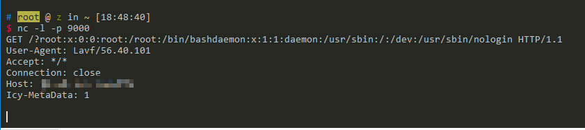

# ffmpeg 任意文件读取漏洞/SSRF漏洞 （CVE-2016-1897/CVE-2016-1898）

运行环境：

```
docker-compose build
docker-compose up -d
```

## 原理

- http://xdxd.love/2016/01/18/ffmpeg-SSRF%E6%BC%8F%E6%B4%9E%E5%88%86%E6%9E%90/
- http://blog.neargle.com/SecNewsBak/drops/CVE-2016-1897.8%20-%20FFMpeg%E6%BC%8F%E6%B4%9E%E5%88%86%E6%9E%90.html
- http://habrahabr.ru/company/mailru/blog/274855/

## 测试过程

详见参考文章，不再赘述。

成功读取文件：


