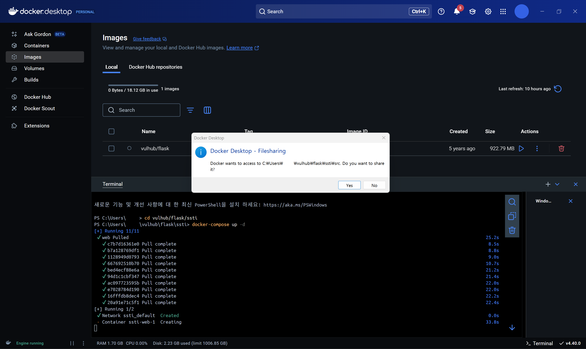
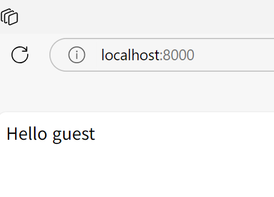
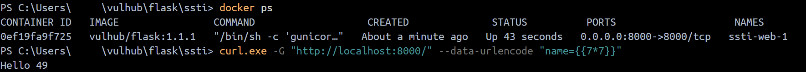
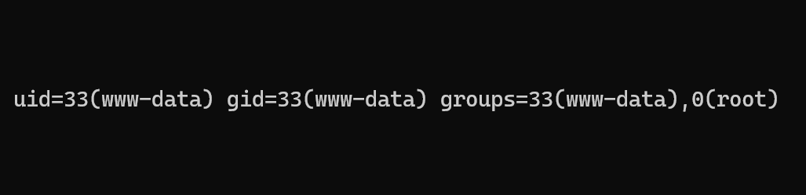

# Flask SSTI Vulnerability PoC Report
> 화이트햇 스쿨 3기 - [21반 김태현](https://github.com/alexanderwangamja)

## CVE Overview
- **Name**: Server-Side Template Injection (SSTI) in Flask
- **Type**: Server-Side Template Injection (SSTI)
- **Affected Component**: Flask Jinja2 Template Engine
- **Impact**: Remote Code Execution (RCE) via unsafe template evaluation

## Environment Setup

- **Vulnerable Environment**: Vulhub - Flask SSTI Module
- **Base Image**: vulhub/flask:1.1.1
- **Setup Steps**:
  1. Clone the Vulhub repository.
  2. Move to the Flask SSTI directory:
     ```bash
     cd vulhub/flask/ssti
     ```
  3. Run docker-compose:
     ```bash
     docker-compose up -d
     ```
  4. Verify that the server is running at [http://localhost:8000/](http://localhost:8000/).

### Screenshots

- Docker container running:

  

- Flask server accessible at localhost:8000:

  

- Basic SSTI exploitation (`{{7*7}}`) resulting in 49:

  

## PoC (Proof of Concept)

- **Exploit Method**: Send a crafted template expression through user input to evaluate server-side code.

- **Attack Payload**:
  ```bash
  curl.exe -G "http://localhost:8000/" --data-urlencode "name={{7*7}}"
  ```

- **Expected Result**:
  - The server processes the template and outputs `Hello 49`.
  - This confirms arbitrary code execution via template injection.

## Advanced PoC Using Python Script

- Executed the Python script (`poc.py`) to generate an exploit URL.
- Accessed the generated URL to trigger the server to execute the system command `id`.
- As a result, the output `uid=33(www-data) gid=33(www-data) groups=33(www-data),0(root)` was observed.
- This confirms that **Remote Code Execution (RCE)** is possible through server-side template injection.

### Screenshot

- Result of executing the exploit:

  

## Analysis

- This vulnerability occurs because user input is directly evaluated by the server without proper sanitization.
- Attackers can execute arbitrary expressions or even system commands depending on the server configuration.

## Prevention and Mitigation

- **Never directly render user input in templates.**
- **Use safe rendering functions** like `render_template_string` with explicit context separation.
- **Update to the latest Flask and Jinja2 versions**, which have more secure defaults.
- **Apply strict Content Security Policy (CSP)** headers to mitigate impact.

## Conclusion

This exercise demonstrated how a simple input field vulnerability in a Flask application could lead to server-side code execution via SSTI. To ensure secure web application development, it is critical to validate and sanitize all user inputs, especially in templating systems.

---

# Repository Link

- TBU

---
