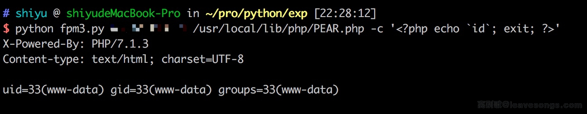

# PHP-FPM Fastcgi Unauthorized Access Vulnerability

## Principle

See https://www.leavesongs.com/PENETRATION/fastcgi-and-php-fpm.html for details.

## Test environment construction

Run the test environment directly by executing `docker-compose up -d`, and the environment listens to 9000 ports.

## EXP

Exp See https://gist.github.com/phith0n/9615e2420f31048f7e30f3937356cf75

Results of the:

