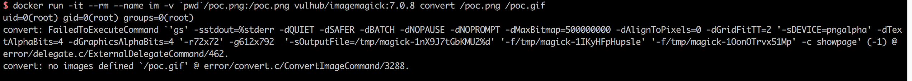

# GhostScript Sandbox Bypass (Command Execution) Vulnerability

On August 21st, Tavis Ormandy used the public mailing list to point out that GhostScript's security sandbox can be bypassed. By constructing malicious image content, it can cause loopholes such as command execution, file reading, and file deletion:

 - http://seclists.org/oss-sec/2018/q3/142
 - https://bugs.chromium.org/p/project-zero/issues/detail?id=1640

GhostScript is used by many image processing libraries, such as ImageMagick, Python PIL, etc. By default, these libraries distribute them to different processing methods based on the content of the image, including GhostScript.

## vulnerability environment

Execute the following command to start the vulnerability environment (including the latest version of GhostScript 9.23, ImageMagick 7.0.8):

```
Docker-compose up -d
```

After the environment is started, you can see an upload component by visiting `http://your-ip:8080`.

## Vulnerability recurrence

Upload [poc.png](poc.png) and execute the command `touch /tmp/success`. At this point into the container `docker-compose exec web bash`, you will see that /tmp/success has been created:


You can also test the vulnerability using the command line:

```
Docker run -it --rm --name im -v `pwd`/poc.png:/poc.png vulhub/imagemagick:7.0.8 convert /poc.png /poc.gif
```



It can be seen that the id command has been successfully run.