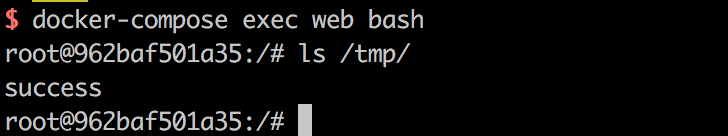

# GhostScript 沙箱绕过（命令执行）漏洞（CVE-2018-16509）

8 月 21 号，Tavis Ormandy 通过公开邮件列表，再次指出 GhostScript 的安全沙箱可以被绕过，通过构造恶意的图片内容，将可以造成命令执行、文件读取、文件删除等漏洞：

 - http://seclists.org/oss-sec/2018/q3/142
 - https://bugs.chromium.org/p/project-zero/issues/detail?id=1640

GhostScript 被许多图片处理库所使用，如 ImageMagick、Python PIL 等，默认情况下这些库会根据图片的内容将其分发给不同的处理方法，其中就包括 GhostScript。

## 漏洞环境

执行如下命令启动漏洞环境（其中包括最新版 GhostScript 9.23、ImageMagick 7.0.8）：

```
docker-compose up -d
```

环境启动后，访问`http://your-ip:8080`将可以看到一个上传组件。

## 漏洞复现

上传[poc.png](poc.png)，将执行命令`id > /tmp/success && cat /tmp/success`。此时进入容器`docker-compose exec web bash`，将可以看到/tmp/success已被创建：



你也可以使用命令行测试该漏洞：

```
docker run -it --rm --name im -v `pwd`/poc.png:/poc.png vulhub/imagemagick:7.0.8-10 convert /poc.png /poc.gif
```


可见，id命令已被成功运行。
