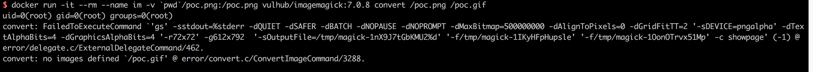

# GhostScript Sandbox Bypass Command Execution (CVE-2018-16509)

[中文版本(Chinese version)](README.zh-cn.md)

GhostScript is a suite of software based on an interpreter for Adobe Systems' PostScript and PDF page description languages. It is widely used by many image processing libraries such as ImageMagick and Python PIL.

On August 21st, 2018, security researcher Tavis Ormandy disclosed that GhostScript's security sandbox could be bypassed through maliciously crafted image content, leading to command execution, file reading, and file deletion vulnerabilities.

References:

- <http://seclists.org/oss-sec/2018/q3/142>
- <https://bugs.chromium.org/p/project-zero/issues/detail?id=1640>

## Environment Setup

Execute the following command to start a vulnerable environment (including GhostScript 9.23 and ImageMagick 7.0.8):

```
docker compose up -d
```

After the server is started, visit `http://your-ip:8080` to see an upload component.

## Vulnerability Reproduction

Upload [poc.png](poc.png) to execute the command `id > /tmp/success && cat /tmp/success`. Enter the container using `docker compose exec web bash`, and you will see that /tmp/success has been created.


You can also test this vulnerability using the command line:

```
docker run -it --rm --name im -v `pwd`/poc.png:/poc.png vulhub/imagemagick:7.0.8-10 convert /poc.png /poc.gif
```

The command execution result shows that the `id` command has been successfully executed.


