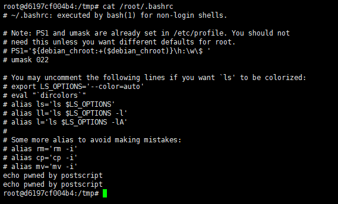
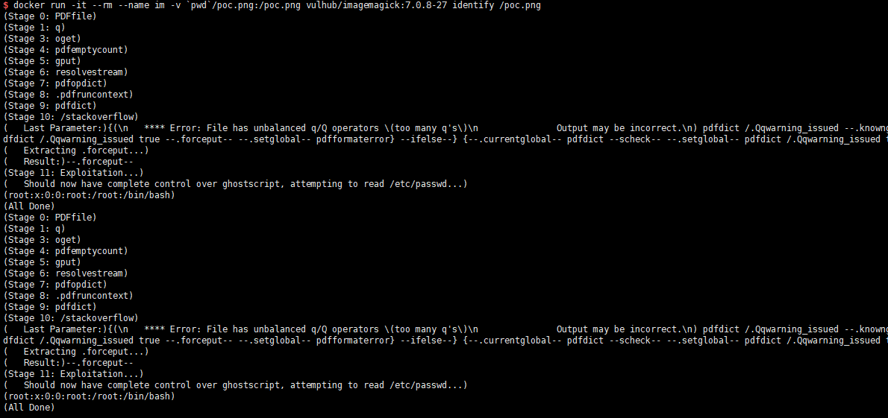

# GhostScript 沙箱绕过（命令执行）漏洞（CVE-2019-6116）

2019年1月23日晚，Artifex官方在ghostscriptf的master分支上提交合并了多达6处的修复。旨在修复 CVE-2019-6116 漏洞，该漏洞由 Google 安全研究员 Tavis 于2018年12月3日提交。该漏洞可以直接绕过 ghostscript 的安全沙箱，导致攻击者可以执行任意命令/读取任意文件。

GhostScript 被许多图片处理库所使用，如 ImageMagick、Python PIL 等，默认情况下这些库会根据图片的内容将其分发给不同的处理方法，其中就包括 GhostScript。

参考链接：

- https://bugs.chromium.org/p/project-zero/issues/detail?id=1729&desc=2
- https://www.anquanke.com/post/id/170255

## 漏洞环境

执行如下命令启动漏洞环境（其中包括最新版 GhostScript 9.26、ImageMagick 7.0.8-27）：

```
docker-compose up -d
```

环境启动后，访问`http://your-ip:8080`将可以看到一个上传组件。

## 漏洞复现

作者给出了[POC](poc.png)，上传这个文件，即可执行`id > /tmp/success`：



我们也可以用``docker run -it --rm --name uu -v `pwd`/poc.png:/tmp/poc.png vulhub/imagemagick:7.0.8-27-php identify /tmp/poc.png``来直接测试poc：


