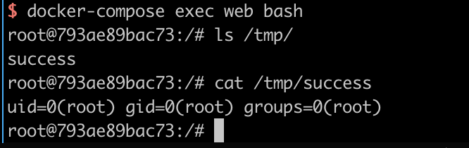
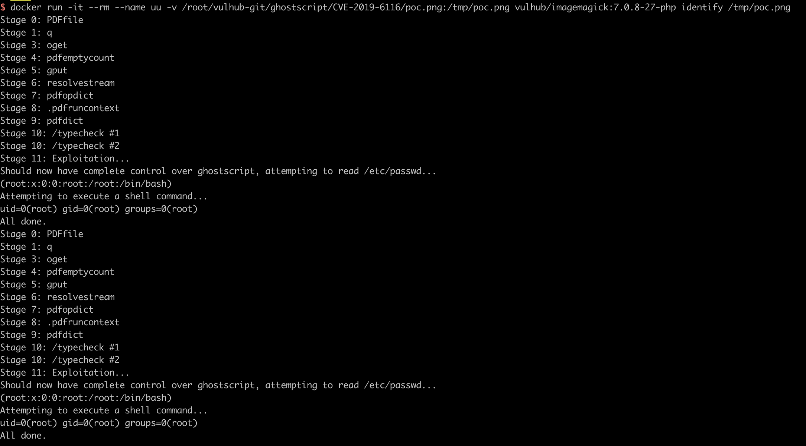

# GhostScript 沙箱绕过命令执行漏洞（CVE-2019-6116）

GhostScript 是一套基于 Adobe Systems 的 PostScript 和 PDF 页面描述语言解释器的软件。它被许多图像处理库广泛使用，如 ImageMagick、Python PIL 等。

2019年1月23日，Artifex 官方在 GhostScript 的 master 分支上合并了多达6处的修复，用于修复 CVE-2019-6116 漏洞。该漏洞由 Google 安全研究员 Tavis 于2018年12月3日提交。漏洞允许攻击者直接绕过 GhostScript 的安全沙箱，从而执行任意命令或读取任意文件。

参考链接：

- <https://bugs.chromium.org/p/project-zero/issues/detail?id=1729&desc=2>
- <https://www.anquanke.com/post/id/170255>

## 环境搭建

执行如下命令启动漏洞环境（其中包括 GhostScript 9.26 和 ImageMagick 7.0.8-27）：

```
docker compose up -d
```

环境启动后，访问 `http://your-ip:8080` 将看到一个文件上传组件。

## 漏洞复现

上传提供的 [POC](poc.png) 文件，即可执行命令 `id > /tmp/success`。



你也可以使用命令行来测试该漏洞：

```
docker run -it --rm --name uu -v `pwd`/poc.png:/tmp/poc.png vulhub/imagemagick:7.0.8-27-php identify /tmp/poc.png
```

命令将被成功执行。


