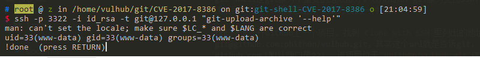

# GIT-SHELL Sandbox Bypass (CVE-2017-8386)

[中文版本(Chinese version)](README.zh-cn.md)

Git shell is a login shell for SSH accounts to provide restricted Git access. git-shell in git before 2.4.12, 2.5.x before 2.5.6, 2.6.x before 2.6.7, 2.7.x before 2.7.5, 2.8.x before 2.8.5, 2.9.x before 2.9.4, 2.10.x before 2.10.3, 2.11.x before 2.11.2, and 2.12.x before 2.12.3 might allow remote authenticated users to bypass the git-shell sandbox and execute arbitrary commands, after leveraging a less command-line-based command execution vulnerability.

References:

 - https://insinuator.net/2017/05/git-shell-bypass-by-abusing-less-cve-2017-8386/
 - https://www.leavesongs.com/PENETRATION/git-shell-cve-2017-8386.html

## Environment Setup

Run the following command to start a SSH server that has a git-shell login shell:

```
docker compose up -d
```

To avoid port conflicts with the Docker host's SSH port, Vulhub sets the container's SSH port to 3322. In this directory, Vulhub has generated an `id_rsa` file, which is the SSH private key that you need to specify when connecting.

Before connecting, you need to set the private key permissions to 0600: `chmod 0600 id_rsa`, otherwise the connection may fail.

When normally connecting to its SSH service `ssh -p 3322 -i id_rsa git@127.0.0.1`, you will be intercepted by git-shell, returning the error `fatal: unrecognized command ''`, and the connection will be closed.

## Vulnerability Reproduction

Use the --help trick to connect to the target and enter the help page:

```
ssh -p 3322 -i id_rsa -t git@127.0.0.1 "git-upload-archive '--help'"
```

Press `shift`+e to read arbitrary files:


Return to the help page, enter `!id` to execute commands:



(Why is it the www-data user? Because the git user and www-data user both have ID 33, so they are actually the same user)

## Principle

### Git Pull Process Based on SSH Protocol

git-shell is an important component of git services. As we know, git services support three protocols for project transmission: SSH, git, and HTTPS, among which SSH is the most secure and convenient.

If we open any project on Github and find the address listed in `Clone with SSH`: git@github.com:phith0n/vulhub.git, this URL actually tells git that the SSH username is git, the address is github.com (default port is 22), and the project is located in the `phith0n/vulhub.git` directory; then git connects to github.com via SSH protocol and pulls the project from the corresponding directory.

Therefore, git clone and other operations based on SSH protocol are essentially processes of connecting to the git server via SSH protocol and pulling from the specified directory.

So, since this is an SSH interactive process, can I directly execute `ssh git@github.com` to log in to the github server? Obviously not, you can try:


Saying "not possible" is actually not entirely accurate. I did connect to its SSH service and pass authentication, but it gave me a prompt message "Hi phith0n! You've successfully authenticated, but GitHub does not provide shell access." and then closed my connection.

Therefore, normally, the git pull process based on SSH is secure for the git server.

For information on how to set up a git server, you can refer to [this article](http://www.liaoxuefeng.com/wiki/0013739516305929606dd18361248578c67b8067c8c017b000/00137583770360579bc4b458f044ce7afed3df579123eca000)

### How to Prevent Git Users from Executing System Shell

So, how do git service providers like GitHub implement the above "secure" communication process?

There are two ways to allow users to authenticate via SSH but not give them a shell:

1. Set the shell to git-shell when creating the system user git
2. Set command in the authorized_keys file before each ssh-key to override or hijack the original command

The first method is more straightforward - when creating the user, instead of giving them a normal bash or sh shell, give them a git-shell. git-shell is a sandbox environment where only commands included in the sandbox can be executed.

The second method is not only used on git servers but also in many Linux distributions. For example, AWS by default does not allow root login, implemented by setting `command="echo 'Please login as the user \"ec2-user\" rather than the user \"root\".';echo;sleep 10"` in /root/.ssh/authorized_keys. This effectively overrides the original shell execution with an echo command.

Of course, git-shell can also be used within the second method. For example, when adding a git user, give them a normal `/bin/bash` but set `command="git-shell -c \"$SSH_ORIGINAL_COMMAND\""` in authorized_keys, which still effectively uses git-shell.

### git-shell Sandbox Bypass Vulnerability (CVE-2017-8386)

git-shell is a shell that can restrict user command execution. If we create a new directory called `git-shell-commands` in the git user's home directory and put the commands you allow users to execute in this directory, we've created a sandbox. In git-shell, only commands in the `/home/git/git-shell-commands` directory can be executed.

If the system doesn't have a `git-shell-commands` directory, then git-shell by default only allows the execution of these three commands:

- `git-receive-pack <argument>`
- `git-upload-pack <argument>`
- `git-upload-archive <argument>`

This is the whitelist.

However, the author of CVE-2017-8386 discovered that executing `git-upload-archive --help` (or `git-receive-pack --help`) will enter an interactive man page, which calls the less command, resulting in a help document that can be scrolled up and down.

This seems harmless, but the less command has a feature that supports some interactive methods. For example, in the less page, pressing `shift`+e opens the Examine function, through which arbitrary files can be read; entering `!id` can execute the id command.

You can try this on any Linux computer - execute `less /etc/passwd` to get to the less page, then in English input mode, type `!id`, and you can execute the id command:


So, using this feature, we can bypass the git-shell sandbox to read arbitrary files or execute arbitrary commands!

We can first try executing `git-receive-pack --help` directly in Linux, then enter `!id`, and we'll see similar effects to the above image.

[evi1cg's blog](https://evi1cg.me/archives/CVE-2017-8386.html) has animated GIFs that make this more intuitive.

### Exploitation via SSH

So, how do we exploit this vulnerability remotely?

We tried earlier that directly using `ssh git@gitserver` only gets us git-shell (or returns a reminder message), so we'll use the sandbox bypass vulnerability mentioned in the previous section to execute commands:

```
ssh -p 3322 -i id_rsa -t git@127.0.0.1 "git-upload-archive '--help'"
```

Enter the help page, then press shift+e or enter `!id`.

### Some Limitations

As mentioned earlier, there are two ways to configure git users to prevent SSH shell access: one is to set their shell to `/usr/bin/git-shell` when creating the user, and the other is to override the command in authorized_keys.

If the target server uses the first method, even if we successfully execute `git-upload-archive '--help'` and enter the help page, we still can't execute commands. This is because `!id` is still executed under git-shell, and since git-shell doesn't have the id command, it still won't succeed.

However, reading files is always possible because file reading is not done through commands, so it's not affected by the git-shell sandbox.

If the target server configures git-shell using the second method, like in this test environment where I set the git user's shell to bash in the `/etc/passwd` file but override the command in authorized_keys to execute git-shell.

In this case, if we enter the help page and input `!id`, we can successfully execute the id command because it's executed under bash rather than git-shell, so there are no sandbox restrictions.

In summary, this vulnerability can at least achieve arbitrary file reading, and potentially arbitrary command execution.
