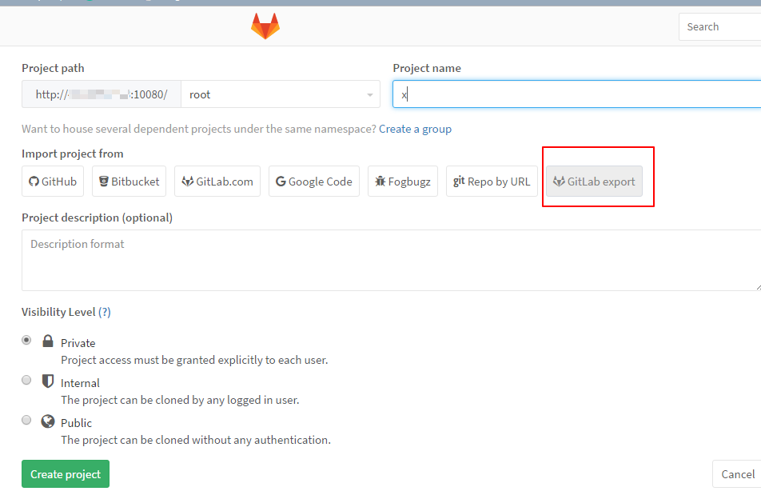
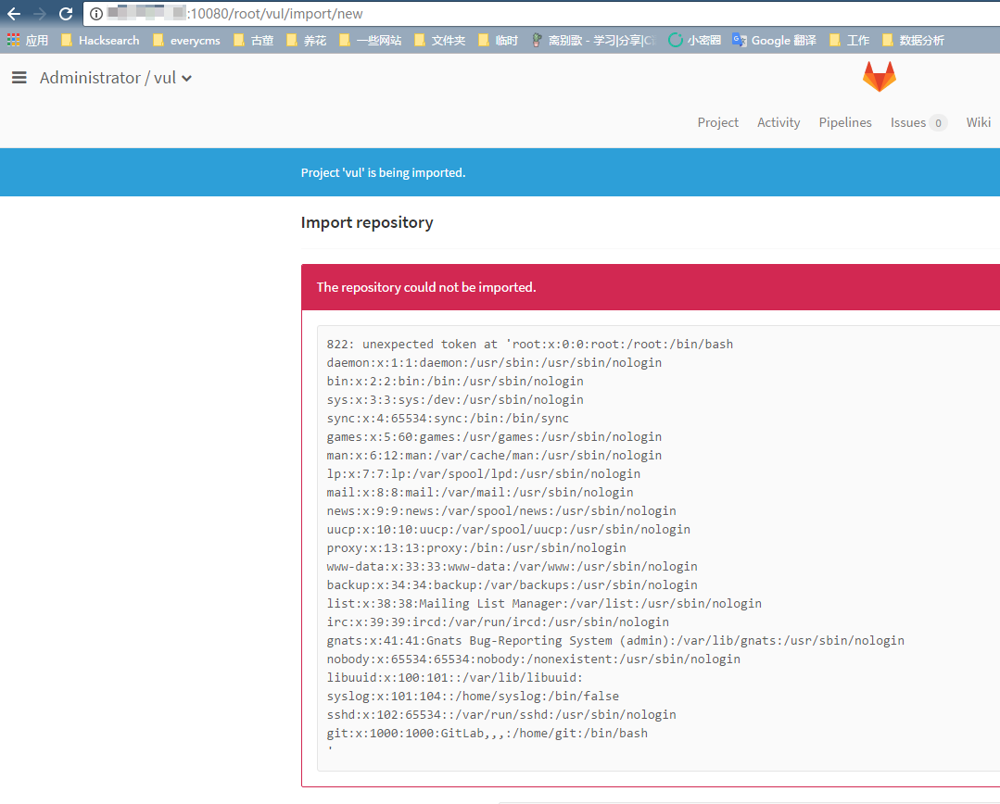

# Gitlab 任意文件读取漏洞（CVE-2016-9086）

Gitlab版本：8.13.1

原理剖析：http://paper.seebug.org/104/

## 测试环境

编译及运行环境：

```
docker-compose build
docker-compose up -d
```

请使用2G及以上内存的VPS或虚拟机运行该环境，实测1G内存的机器无法正常运行Gitlab（运行后502错误）。

## 漏洞测试

环境运行后，Web端口为10080，ssh端口为10022。访问`http://your-ip:10080`，设置管理员（用户名`root`）密码，登录。

新建一个项目，点击`GitLab export`：



将[test.tar.gz](test.tar.gz)上传，将会读取到`/etc/passwd`文件内容：

