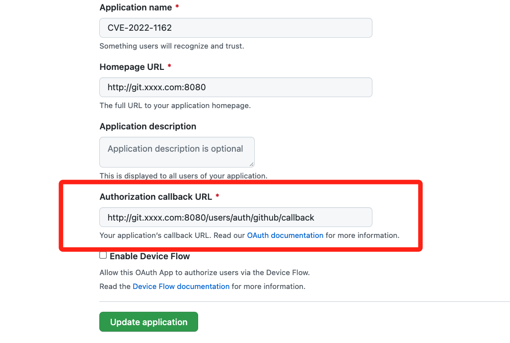
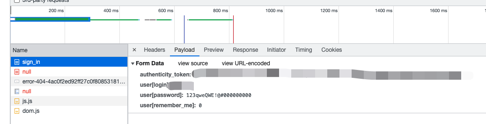

# Gitlab Hardcoded Password for Oauth Users (CVE-2022-1162)

[中文版本（Chinese version）](./README.zh-cn.md)

# Vulnerable environment

Go to [Github App](https://github.com/settings/applications/new) and registe an Oauth2 application, with the `Authorization callback URL` filled with `http://your-gitlab-ip:51080/users/auth/github/callback`, it's OK if the IP is a local IP such as `127.0.0.1`.



Edit gitlab's config file `config/gitlab.rb` and fill in the app ID and secret from gitlab Oauth application.

```yml
gitlab_rails['omniauth_providers'] = [
  {"name" => "github",
   "app_id" => "Your-github-app-ID",
   "app_secret" => "Your-github-app-secret",
   "args" => {
     "scope" => "user:email"
   }
  }
]
```

Use following command to start a GitLab-CE 14.7.4:

```shell
docker-compose up -d
```

Now the gitlab serves in `http://ip:51080`. While Gitlab takes some time to start up (HTTP returns 502).

# Exploit
Browse the gitlab login page `http://gitlab-ip:51080/`, and **Sign in with Github**.

Now that the gitlab has a user with your github infomation, you can log in with the username and password of **123qweQWE!@#000000000**.


