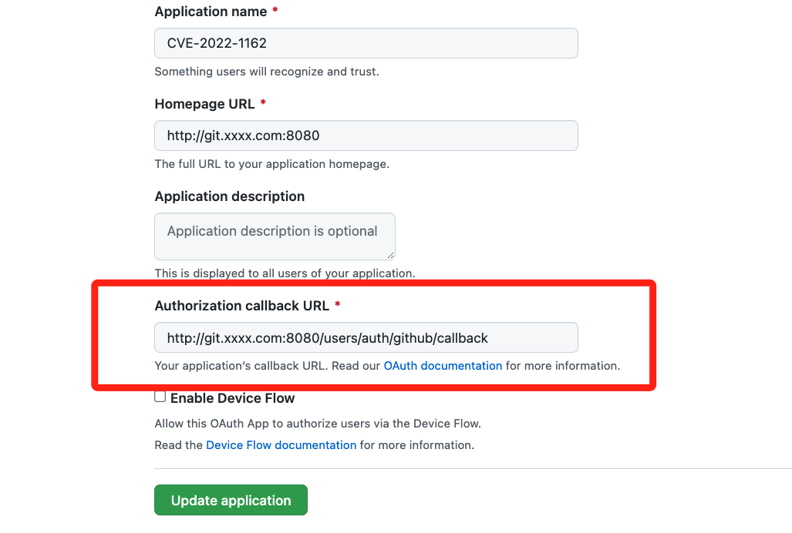
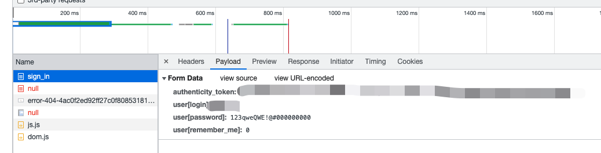

# Gitlab为Oauth用户配置硬编码密码（CVE-2022-1162）

# 漏洞环境

前往[Github App](https://github.com/settings/applications/new)并注册一个用于Oauth2的应用，在`Authorization callback URL`需要填写上`http://your-gitlab-ip:51080/users/auth/github/callback`，如果是IP是本地地址也可以，例如`127.0.0.1:51080`。



编辑Gitlab的配置文件`config/gitlab.rb`，需要填入上述注册Github App的ID和secret。

```yml
gitlab_rails['omniauth_providers'] = [
  {"name" => "github",
   "app_id" => "Your-github-app-ID",
   "app_secret" => "Your-github-app-secret",
   "args" => {
     "scope" => "user:email"
   }
  }
]
```

使用`docker-compose`启动Gitlab-CE 14.7.4：

```shell
docker-compose up -d
```

然后可以在浏览器去访问Gitlabe了：`http://ip:51080`，不过Gitlab启动要很久，所以遇到502的话就耐心等待一下。

# 漏洞利用

通过浏览器访问Gitlab，并且选择`通过Github登录`。

Github登录完成后跳转回到Gitlab，就完成了Oauth用户注册和登录，然后就可以退出登录，并使用默认的硬编码密码**123qweQWE!@#000000000**进行登录了。



