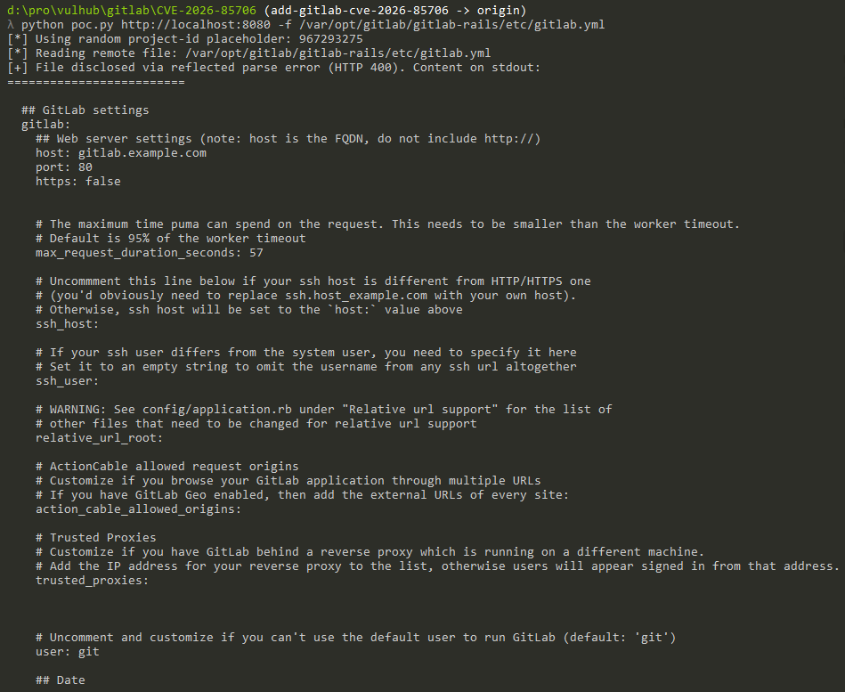

# GitLab 未授权任意本地文件读取漏洞（CVE-2026-85706）

[GitLab](https://about.gitlab.com/) 是一个开源 DevSecOps 平台，提供 Git 仓库管理、问题跟踪和持续集成等功能。

CVE-2026-85706 是 GitLab Workhorse 与 Repository Commits API 交互过程中的路径限制不当漏洞，影响 GitLab CE 和 EE 18.7.0 至 19.1.7、19.2.0 至 19.2.5，以及 19.3.0 至 19.3.1 版本。未认证攻击者可以借助公开项目绕过 Workhorse 的请求体上传处理，将未经验证的本地路径传给 GitLab Rails。Rails 会在认证用户之前读取该文件。如果文件内容能够使 Rack 表单解析器抛出会反射输入内容的解析错误，部分文件内容就会出现在 HTTP 响应中。因此，虽然漏洞代码会读取任意可访问路径，但是否泄露内容仍取决于目标文件本身的内容。

参考链接：

- <https://docs.gitlab.com/releases/patches/patch-release-gitlab-19-3-2-released/>
- <https://gitlab.com/gitlab-org/gitlab/-/commit/0d9ce3e758a85f0690be751e213625f7902c0361>
- <https://www.cve.org/CVERecord?id=CVE-2026-85706>

## 环境搭建

执行如下命令启动 GitLab Community Edition 19.3.1：

```
docker compose up -d
```

GitLab 首次启动可能需要数分钟。服务就绪后，访问 `http://your-ip:8080`，使用账号密码 `root:vulhub123456` 登录。新建一个公开的空白项目，使用 README 初始化项目，然后退出登录。公开项目是匿名访问漏洞接口的前提条件。

## 漏洞复现

首先，在当前目录执行随环境提供的 PoC 脚本。该脚本无需凭据即可查询公开项目 API、选择一个公开项目，并向 Repository Commits API 发送未签名的上传元数据。`/repository/commits/` 末尾的斜杠使 Workhorse 中严格锚定的上传路由无法匹配，但 GitLab Rails 仍会将该请求路由到 Commits API：

```
python3 poc.py http://your-ip:8080
```

该脚本会让 GitLab Rails 读取 `/var/opt/gitlab/gitlab-rails/etc/gitlab.yml`。这是 GitLab Omnibus 启动过程中自然生成的配置文件，实验镜像没有向其中添加专门构造的数据。在未经修改的 GitLab 19.3.1 环境中，该文件自身包含能够触发 Rack 反射型表单解析错误的百分号序列。存在漏洞的服务器将返回 HTTP 400 响应，并在响应中包含以 `## GitLab settings` 开头的文件内容。这表明未认证请求成功泄露了服务器本地文件。

普通的 `/etc/passwd` 等文件仍会在认证前被打开并读取，但当文件内容能够被正常解析时，其字节内容不一定会出现在响应中。PoC 选择 `gitlab.yml`，是因为该文件由原始应用正常生成，可以真实展示已确认的内容泄露通道。


